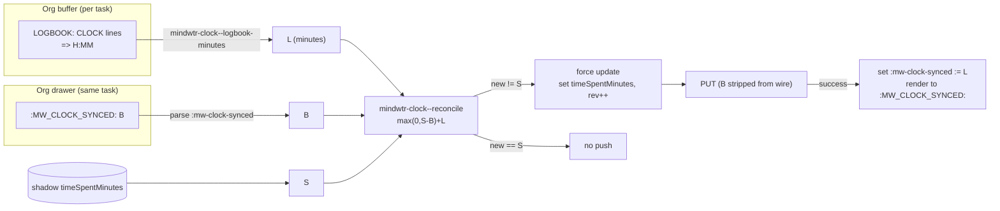

# feat: Roll up org-clock LOGBOOK time into synced `timeSpentMinutes`

## Summary

Sum each task's closed org-clock LOGBOOK entries and write the total into the
synced `timeSpentMinutes` field, so time clocked in Emacs shows up on phone and
desktop. The write is **reconciled**, not overwriting: the server's
`timeSpentMinutes` may already hold time worked outside Emacs (focus/pomodoro
sessions on other devices), and that outside time must be preserved and kept
growing while our own clocked time is layered on top. LOGBOOK entries deleted
in Emacs must lower the total by exactly the removed amount.

`timeSpentMinutes` is already **recognized** by the client (added to
`mindwtr-model-known-fields` in the schema-refresh work) but never written; it
flows through verbatim today. This feature makes the client the authoritative
writer of the Emacs-contributed portion.

---

## Problem Frame

The client fully supports org clocking: users clock tasks with `org-clock`,
CLOCK lines accumulate in LOGBOOK drawers, and the reconcile layer already
preserves LOGBOOK/CLOCK across a buffer rebuild and re-points a running clock
(`mindwtr-reconcile.el`). That clocked time is invisible to the rest of
Mindwtr because the client has never populated `timeSpentMinutes`.

The naive fix — write the LOGBOOK sum straight into `timeSpentMinutes` — is
wrong on two counts the user called out:

1. The **server also writes** `timeSpentMinutes` (focus/pomodoro sessions).
   Overwriting with our sum would erase time worked outside Emacs.
2. **LOGBOOK entries can be deleted** in Emacs. A scheme that only ever adds
   (e.g. "server went up ⇒ outside work") cannot represent our contribution
   going *down*.

So the write must separate the server total into an *outside* portion and an
*Emacs* portion, preserve/grow the former, and re-assert the latter from the
current LOGBOOK each cycle.

---

## The Reconciliation Model

Per task, at sync time, three quantities (all in minutes):

- **L** — current LOGBOOK sum in the buffer: the total of `=> H:MM` durations
  on **closed** CLOCK lines under the task heading. A running (open) clock has
  no `=>` total and is excluded by construction.
- **S** — the server's `timeSpentMinutes` as pulled/merged this cycle.
- **B** — the **baseline**: the LOGBOOK sum we last contributed, persisted in
  the task's own org drawer (`:MW_CLOCK_SYNCED:`, minutes) from the previous
  successful cycle. Absent ⇒ 0.

Reconcile:

```
outside = max(0, S − B)
new     = outside + L
```

On a **confirmed-successful** cycle, advance `B := L`.

### Why this is correct

| Case | Effect |
|------|--------|
| Outside work added (phone focus session) | `S` rises above `B`; `outside = S − B` captures it and rides along in every future write — outside time is never overwritten. |
| LOGBOOK entry deleted in Emacs | `L` drops below `B`; because `new` re-adds the *current* `L` (not a delta), the total drops by exactly the removed amount. |
| Nothing changed (`L=B`, `S=outside+B`) | `new = S` — identical value, so no push, no `:rev` churn. Stable fixed point. |
| Server value below baseline (cleared elsewhere) | `max(0, …)` floors `outside` at 0; we re-assert our own `L` and let the vanished outside time go. |
| First activation (`B` absent ⇒ 0) | All existing LOGBOOK history is added once on top of the server value. Since Emacs has never written `timeSpentMinutes`, the server value is pure outside time, so this is arithmetically correct. **(Confirmed desired.)** |

The baseline is the *LOGBOOK sum*, not the last total — that is precisely what
lets a deletion propagate: re-adding current `L` against a preserved `outside`
reflects removals as well as additions.

---

## Key Technical Decisions

- **KTD1 — `timeSpentMinutes` stays OUT of `mindwtr-model-content-fields`.**
  Its written value (`outside + L`) is not reconstructable from the buffer
  alone, so it cannot participate in the org content signature without breaking
  the render=parse byte-stability the allow-list depends on. It is a
  *sync-computed override*, reconciled in a dedicated pass, never signed.

- **KTD2 — A dedicated clock-reconciliation pass can flip an unchanged task
  into a push.** Today an otherwise-unchanged task is echoed verbatim (no PUT).
  The reconciliation must be able to force such a task into the **update** set
  (set `timeSpentMinutes`, bump `:rev`) when `new ≠ S`, and only then.

- **KTD3 — Baseline persists in the task's own org drawer, not a sidecar or a
  shadow field.** `B` is written as a device-local drawer property
  `:MW_CLOCK_SYNCED:` (minutes) on the task heading. This rides the *proven*
  `:mw-extra-props` mechanism: parsed into an internal `:mw-clock-synced` key,
  **rendered** back to the drawer on heading rebuild (`mindwtr-render.el:212`
  pattern), and listed in `mindwtr-parse--internal-keys`
  (`mindwtr-parse.el:329`) so it is **stripped before the wire** — persisted in
  the org file, never sent to the server, invisible to the content signature.
  Registered in `mindwtr-parse--known-props` so it is consumed, not dumped into
  `:mw-extra-props`; absent ⇒ 0. Chosen over a `clock-baseline.json` sidecar
  because the org file is the durable, backed-up, version-controlled artifact
  while the shadow/cache dir is disposable — clearing the cache or reinstalling
  the package no longer resets the baseline (closes the sidecar-loss
  double-count). Because it is not a content field, writing it never marks the
  task dirty — the same guarantee `:mw-extra-props` already relies on.

- **KTD4 — Baseline advances only on a confirmed-successful cycle.** After a
  successful PUT, `:mw-clock-synced := L` is set on the entity and written to the
  drawer by the reconcile/render step, on the same guarded success path as
  `mindwtr-shadow-save` / the `notes-migrated` latch (`mindwtr-sync.el:866–877`).
  A failed push leaves `B` untouched so the next cycle does not mis-account.
  Because `B` and `L` now live in the same buffer, they cannot desync under a
  crash — but a buffer-*save* failure after a successful PUT would leave `B`
  un-advanced and re-inflate next cycle; this is the same rare partial-failure
  window the sidecar had, now bounded to disk-full/permission errors on the org
  save.

- **KTD5 — Running clock excluded.** Summing only `=> H:MM` closed-clock totals
  naturally excludes a live clock, so a task being clocked does not recompute
  `timeSpentMinutes` — and churn `:rev` — on every sync. **(Confirmed.)**

- **KTD6 — Isolated `mindwtr-clock.el` module.** LOGBOOK summing and the pure
  reconciliation function live in one new file with a small interface;
  `mindwtr-sync.el` requires it. The `:MW_CLOCK_SYNCED:` parse/render/strip
  wiring belongs to the existing parse/render layer (it is just another drawer
  property), not to this module. Keeps the compute out of parse and the
  reconcile logic independently testable.

- **KTD7 — Single Emacs client assumed, but the drawer baseline degrades
  gracefully across devices.** Two independent Emacs installs each carry their
  own `:MW_CLOCK_SYNCED:`, so each correctly treats the other's contribution as
  *outside* time and preserves it; if the org files are file-synced between
  devices, the property rides along and stays consistent. Tight multi-Emacs
  coordination (same task clocked concurrently on both, files mid-conflict)
  remains out of scope.

- **KTD8 — Per-task only.** `timeSpentMinutes` is a task field; projects/areas
  carry none, so there is no upward roll-up to a parent. "Roll up" here means
  summing a task's several CLOCK entries into one number.

- **KTD9 — The pass runs before the noop gate (R8).** `mindwtr-sync-once`
  short-circuits to `:noop` at the HEAD-ETag gate when nothing is `local-dirty`
  (`mindwtr-sync.el:789` region). A clock-only change signs nothing, so it marks
  nothing dirty — the reconcile pass sited after classification would never run
  in its headline case. A clock-dirty predicate (any live task with `new ≠ S`)
  must be evaluated before that gate and force a full cycle when true.

- **KTD10 — `S` is read from the shadow, not the post-GET `merged`.** The
  baseline arithmetic needs the server total *this device last saw committed* —
  the shadow's `timeSpentMinutes` — not a value already re-merged this cycle,
  which would double-account.

- **KTD11 — `L` and `B` are read from the parsed local by id, never off the
  wire.** Both are device-local (`:mw-logbook-minutes`, `:mw-clock-synced`) and
  are stripped before the candidate; the pass looks them up on the parsed local
  entity, not on any outbound/inbound payload.

---

## High-Level Design



---

## Components / Implementation Units

### U1. `mindwtr-clock.el` — LOGBOOK sum + reconcile (pure)

- `mindwtr-clock--logbook-minutes` — at a task heading, sum the `=> H:MM`
  totals of closed CLOCK lines within the entry region (not descendant
  headings; tasks do not nest). Regex-based; independent of live org-clock
  state. Returns an integer minute count (0 when none).
- `mindwtr-clock--reconcile (s b l)` — pure: `(+ (max 0 (- s b)) l)`, coercing
  nil `s`/`b`/`l` to 0. No I/O.

No sidecar file — the baseline lives in the drawer (U2), so this module holds
only the two pure computations.

**Tests:** the reconcile case table (added/deleted/unchanged/underflow/first-run,
plus nil-coercion) as pure-function assertions; `logbook-minutes` over fixtures
with multiple closed clocks, a running clock (excluded), and no logbook.

### U2. Drawer wiring — `L` from LOGBOOK, `B` from `:MW_CLOCK_SYNCED:`

- **`L`:** compute per live task where the buffer is available and carry it on
  the parsed task under an internal, non-content key `:mw-logbook-minutes`
  (always an integer, never nil), surviving to the sync layer like
  `:mw-extra-props` — never entering content, the signature, or the wire.
- **`B`:** add `MW_CLOCK_SYNCED` to `mindwtr-parse--known-props` (consumed, not
  preserved as extra); parse into `:mw-clock-synced` (absent ⇒ 0); add
  `:mw-clock-synced` to `mindwtr-parse--internal-keys` so it is stripped before
  the candidate/PUT; add `(:mw-clock-synced . "MW_CLOCK_SYNCED")` to the render
  map so heading rebuilds preserve it.

**Tests:** a parsed task exposes its LOGBOOK minutes and its `:mw-clock-synced`
baseline; neither key appears in content-field comparison / the signature;
`:mw-clock-synced` never appears on a built candidate; a rebuilt heading
round-trips `:MW_CLOCK_SYNCED:` unchanged.

### U3. Clock-reconciliation pass in sync

- After normal create/update/echo classification, for each live task: read `S`
  (from the **shadow** value, not the post-GET merged var — KTD10), `B`
  (`:mw-clock-synced` on the parsed local, by id — KTD11), `L`
  (`:mw-logbook-minutes`); compute `new`. When `new ≠ S`, set
  `timeSpentMinutes := new` on the candidate and force it into the update set
  with `:rev` incremented, and stage `:mw-clock-synced := L` on the entity so
  the render step writes the new baseline to the drawer. When `new = S`, do
  nothing. Reconcile **only tasks parsed this cycle** — never zero a server-live
  task that was not scanned (R9).
- A clock-only change marks nothing dirty, so the pass (and its "any `new ≠ S`?"
  test) must run **before** the HEAD-ETag noop gate and force a full cycle when
  it fires (R8 / KTD9), or the feature never runs in its headline case.

**Tests (sync):** outside-work-preserved; logbook-deleted-lowers-total;
unchanged-produces-no-push (no `:rev` bump); first-run-adds-history;
clock-only-change-bypasses-noop-gate; baseline-not-advanced-on-failed-push;
`:MW_CLOCK_SYNCED:` advances to `L` after a successful push.

---

## Scope Boundaries

**In scope:** per-task reconciliation of LOGBOOK time into `timeSpentMinutes`;
the `:MW_CLOCK_SYNCED:` drawer baseline; the dedicated sync pass;
running-clock exclusion.

**Out of scope:** upward roll-up to project/area totals (a separate display
feature — `timeSpentMinutes` is task-only); tight multi-Emacs coordination; any
rendering of `timeSpentMinutes` as an editable org property (its source of
truth is LOGBOOK + server, not a hand-edited drawer value); reading the
server's internal outside/Emacs split (unavailable — we track the baseline
ourselves). `:MW_CLOCK_SYNCED:` is machine-maintained bookkeeping, not a
user-editable field — a hand-edit is tolerated (it just re-bases the next
reconcile) but not a supported interface.

---

## Alternatives Considered

- **Baseline in a `clock-baseline.json` sidecar.** Rejected (KTD3): the sidecar
  lives in the disposable shadow/cache dir, so a cache clear or package
  reinstall resets `B` to 0 and re-adds the full LOGBOOK history on top of a
  server total that already contains it — a double-count on every cache loss.
  The `:MW_CLOCK_SYNCED:` drawer property stores the baseline in the durable,
  backed-up org file instead, surviving exactly those events.
- **Baseline as a device-local shadow field.** Rejected (KTD3): the persisted
  shadow is the stripped, post-PUT server state, so a device-local field there
  is fragile.
- **`timeSpentMinutes` as a content-field computed in parse.** Rejected (KTD1):
  the written value differs from the parsed LOGBOOK sum, so signing it would
  churn the signature every cycle. It must stay a sync-computed override.
- **`org-clock-sum` for the LOGBOOK total.** Rejected in favor of direct
  `=> H:MM` summing: `org-clock-sum` counts the running clock and leans on
  org-clock dynamic state; direct summing is deterministic in batch and
  excludes the open clock for free (KTD5).
- **"Server went up ⇒ outside work" delta scheme.** Rejected: it cannot
  represent our contribution *decreasing* when LOGBOOK entries are deleted.
  The baseline-as-LOGBOOK-sum model handles both directions.

---

## Risks & Dependencies

- **`:rev` churn (mitigated by KTD5 + the stable fixed point).** If the sum
  were unstable across cycles (e.g. running clock included), every sync would
  push. The closed-clock-only sum plus `new = S` when nothing changed is the
  guard; the unchanged-no-push test is required, not optional.
- **Baseline/shadow divergence on partial failure (mitigated by KTD4).** The
  baseline must advance on exactly the same success condition as the shadow, or
  a failed push mis-accounts next cycle.
- **First-run history dump.** A large historical LOGBOOK lands on the server in
  one sync. Confirmed acceptable; noted so it is not a surprise.
- **Cold rebuild of org files from the server (residual, accepted).** A full
  re-fetch that discards local org files loses `:MW_CLOCK_SYNCED:` (the server
  never stores it), resetting `B` to 0 and re-adding history. This is
  fundamental: with a single `timeSpentMinutes` field and no server-side
  outside/Emacs split, no client can recover `B` after discarding its local
  state. It is rare and deliberate (unlike a cache clear, which the drawer
  baseline now survives), and every alternative shares it. Documented, not
  solved.
- **CI is Emacs 29.3 / Org 9.6.** Verify LOGBOOK parsing and the sync pass
  there (Docker), not just local Emacs, per project convention.

---

## Sources & Research

- Reconciliation model: confirmed with the user, 2026-07-19.
- Client clock handling: LOGBOOK/CLOCK preservation and running-clock
  re-pointing in `mindwtr-reconcile.el`.
- Field status: `timeSpentMinutes` recognized-only in
  `mindwtr-model-known-fields`; deliberately absent from
  `mindwtr-model-content-fields`.
- Success-path persistence: `mindwtr-shadow-save` / `notes-migrated` latch at
  `mindwtr-sync.el:866–877`.
- Drawer-baseline mechanism: `:mw-extra-props` is rendered to the drawer
  (`mindwtr-render.el:212`) yet stripped before the wire via
  `mindwtr-parse--internal-keys` (`mindwtr-parse.el:329`) — the proven
  local-but-unsynced drawer pattern `:MW_CLOCK_SYNCED:` reuses; known-prop
  registry at `mindwtr-parse.el:24`, render map at `mindwtr-render.el:30`.
- Upstream contract: `Task.timeSpentMinutes?: number` (core `types.ts`),
  a server content-signature participant (`sync-signatures.ts`).
