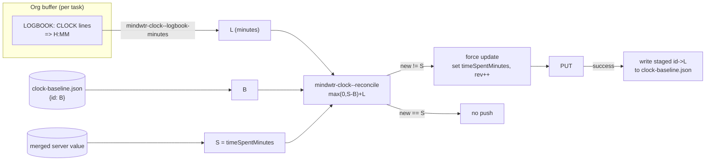

# feat: Roll up org-clock LOGBOOK time into synced `timeSpentMinutes`

## Summary

Sum each task's closed org-clock LOGBOOK entries and write the total into the
synced `timeSpentMinutes` field, so time clocked in Emacs shows up on phone and
desktop. The write is **reconciled**, not overwriting: the server's
`timeSpentMinutes` may already hold time worked outside Emacs (focus/pomodoro
sessions on other devices), and that outside time must be preserved and kept
growing while our own clocked time is layered on top. LOGBOOK entries deleted
in Emacs must lower the total by exactly the removed amount.

`timeSpentMinutes` is already **recognized** by the client (added to
`mindwtr-model-known-fields` in the schema-refresh work) but never written; it
flows through verbatim today. This feature makes the client the authoritative
writer of the Emacs-contributed portion.

---

## Problem Frame

The client fully supports org clocking: users clock tasks with `org-clock`,
CLOCK lines accumulate in LOGBOOK drawers, and the reconcile layer already
preserves LOGBOOK/CLOCK across a buffer rebuild and re-points a running clock
(`mindwtr-reconcile.el`). That clocked time is invisible to the rest of
Mindwtr because the client has never populated `timeSpentMinutes`.

The naive fix — write the LOGBOOK sum straight into `timeSpentMinutes` — is
wrong on two counts the user called out:

1. The **server also writes** `timeSpentMinutes` (focus/pomodoro sessions).
   Overwriting with our sum would erase time worked outside Emacs.
2. **LOGBOOK entries can be deleted** in Emacs. A scheme that only ever adds
   (e.g. "server went up ⇒ outside work") cannot represent our contribution
   going *down*.

So the write must separate the server total into an *outside* portion and an
*Emacs* portion, preserve/grow the former, and re-assert the latter from the
current LOGBOOK each cycle.

---

## The Reconciliation Model

Per task, at sync time, three quantities (all in minutes):

- **L** — current LOGBOOK sum in the buffer: the total of `=> H:MM` durations
  on **closed** CLOCK lines under the task heading. A running (open) clock has
  no `=>` total and is excluded by construction.
- **S** — the server's `timeSpentMinutes` as pulled/merged this cycle.
- **B** — the **baseline**: the LOGBOOK sum we last contributed, persisted
  device-locally from the previous successful cycle.

Reconcile:

```
outside = max(0, S − B)
new     = outside + L
```

On a **confirmed-successful** cycle, advance `B := L`.

### Why this is correct

| Case | Effect |
|------|--------|
| Outside work added (phone focus session) | `S` rises above `B`; `outside = S − B` captures it and rides along in every future write — outside time is never overwritten. |
| LOGBOOK entry deleted in Emacs | `L` drops below `B`; because `new` re-adds the *current* `L` (not a delta), the total drops by exactly the removed amount. |
| Nothing changed (`L=B`, `S=outside+B`) | `new = S` — identical value, so no push, no `:rev` churn. Stable fixed point. |
| Server value below baseline (cleared elsewhere) | `max(0, …)` floors `outside` at 0; we re-assert our own `L` and let the vanished outside time go. |
| First activation (`B` absent ⇒ 0) | All existing LOGBOOK history is added once on top of the server value. Since Emacs has never written `timeSpentMinutes`, the server value is pure outside time, so this is arithmetically correct. **(Confirmed desired.)** |

The baseline is the *LOGBOOK sum*, not the last total — that is precisely what
lets a deletion propagate: re-adding current `L` against a preserved `outside`
reflects removals as well as additions.

---

## Key Technical Decisions

- **KTD1 — `timeSpentMinutes` stays OUT of `mindwtr-model-content-fields`.**
  Its written value (`outside + L`) is not reconstructable from the buffer
  alone, so it cannot participate in the org content signature without breaking
  the render=parse byte-stability the allow-list depends on. It is a
  *sync-computed override*, reconciled in a dedicated pass, never signed.

- **KTD2 — A dedicated clock-reconciliation pass can flip an unchanged task
  into a push.** Today an otherwise-unchanged task is echoed verbatim (no PUT).
  The reconciliation must be able to force such a task into the **update** set
  (set `timeSpentMinutes`, bump `:rev`) when `new ≠ S`, and only then.

- **KTD3 — Baseline persists in a sidecar file, not a shadow field.** The
  persisted shadow (`merged`, `mindwtr-sync.el:866`) is the post-PUT
  server-authoritative state, and device-local fields are stripped during
  candidate building — so a baseline stored as a device-local task field is
  fragile. Instead persist `{taskId: minutes}` in `clock-baseline.json` in the
  shadow directory, matching the existing sidecar/latch convention (`etag`,
  `notes-migrated`).

- **KTD4 — Baseline advances only on a confirmed-successful cycle.** Staged
  `id → L` baselines are written on the same guarded success path as
  `mindwtr-shadow-save` / the `notes-migrated` latch (`mindwtr-sync.el:866–877`).
  A failed push leaves `B` untouched so the next cycle does not mis-account.

- **KTD5 — Running clock excluded.** Summing only `=> H:MM` closed-clock totals
  naturally excludes a live clock, so a task being clocked does not recompute
  `timeSpentMinutes` — and churn `:rev` — on every sync. **(Confirmed.)**

- **KTD6 — Isolated `mindwtr-clock.el` module.** LOGBOOK summing, the pure
  reconciliation function, and sidecar I/O live in one new file with a small
  interface; `mindwtr-sync.el` requires it. Keeps the compute out of parse and
  the reconcile logic independently testable.

- **KTD7 — Single Emacs client assumed.** The baseline is per-device; two
  Emacs devices writing the same task's clock time is out of scope.

- **KTD8 — Per-task only.** `timeSpentMinutes` is a task field; projects/areas
  carry none, so there is no upward roll-up to a parent. "Roll up" here means
  summing a task's several CLOCK entries into one number.

---

## High-Level Design



---

## Components / Implementation Units

### U1. `mindwtr-clock.el` — LOGBOOK sum, reconcile, sidecar

- `mindwtr-clock--logbook-minutes` — at a task heading, sum the `=> H:MM`
  totals of closed CLOCK lines within the entry region (not descendant
  headings; tasks do not nest). Regex-based; independent of live org-clock
  state. Returns an integer minute count (0 when none).
- `mindwtr-clock--reconcile (s b l)` — pure: `(+ (max 0 (- s b)) l)`. No I/O.
- `mindwtr-clock-baseline-load` / `mindwtr-clock-baseline-save` — read/write the
  `{taskId: minutes}` map at `clock-baseline.json` in the shadow dir
  (`mindwtr-shadow--path`), atomic write, absent ⇒ empty map.

**Tests:** the reconcile case table (added/deleted/unchanged/underflow/first-run)
as pure-function assertions; `logbook-minutes` over fixtures with multiple
closed clocks, a running clock (excluded), and no logbook.

### U2. Per-task LOGBOOK sum carried from parse to sync

- Compute `L` per live task where the buffer is available and carry it on the
  parsed task under an internal, non-content key (e.g. `:mw-logbook-minutes`),
  surviving to the sync layer like `:mw-extra-props` — never entering content
  or the signature.

**Tests:** a parsed task exposes its LOGBOOK minutes; the key never appears in
content-field comparison / the signature.

### U3. Clock-reconciliation pass in sync

- After normal create/update/echo classification, for each live task: read `S`
  (merged), `B` (sidecar), `L` (U2); compute `new`. When `new ≠ S`, set
  `timeSpentMinutes := new` on the candidate and force it into the update set
  with `:rev` incremented; stage `id → L`. When `new = S`, do nothing.
- On the guarded success path (`mindwtr-sync.el:866`), write staged baselines;
  prune baseline entries for tasks no longer live (deleted/tombstoned).

**Tests (sync):** outside-work-preserved; logbook-deleted-lowers-total;
unchanged-produces-no-push (no `:rev` bump); first-run-adds-history;
baseline-not-advanced-on-failed-push; deleted-task-pruned-from-baseline.

---

## Scope Boundaries

**In scope:** per-task reconciliation of LOGBOOK time into `timeSpentMinutes`;
the baseline sidecar; the dedicated sync pass; running-clock exclusion.

**Out of scope:** upward roll-up to project/area totals (a separate display
feature — `timeSpentMinutes` is task-only); multi-Emacs coordination; any
rendering of `timeSpentMinutes` as an editable org property (its source of
truth is LOGBOOK + server, not a hand-edited drawer value); reading the
server's internal outside/Emacs split (unavailable — we track the baseline
ourselves).

---

## Alternatives Considered

- **Baseline as a device-local shadow field.** Rejected (KTD3): the persisted
  shadow is the stripped, post-PUT server state, so a device-local field there
  is fragile. Sidecar is the established durable-local pattern.
- **`timeSpentMinutes` as a content-field computed in parse.** Rejected (KTD1):
  the written value differs from the parsed LOGBOOK sum, so signing it would
  churn the signature every cycle. It must stay a sync-computed override.
- **`org-clock-sum` for the LOGBOOK total.** Rejected in favor of direct
  `=> H:MM` summing: `org-clock-sum` counts the running clock and leans on
  org-clock dynamic state; direct summing is deterministic in batch and
  excludes the open clock for free (KTD5).
- **"Server went up ⇒ outside work" delta scheme.** Rejected: it cannot
  represent our contribution *decreasing* when LOGBOOK entries are deleted.
  The baseline-as-LOGBOOK-sum model handles both directions.

---

## Risks & Dependencies

- **`:rev` churn (mitigated by KTD5 + the stable fixed point).** If the sum
  were unstable across cycles (e.g. running clock included), every sync would
  push. The closed-clock-only sum plus `new = S` when nothing changed is the
  guard; the unchanged-no-push test is required, not optional.
- **Baseline/shadow divergence on partial failure (mitigated by KTD4).** The
  baseline must advance on exactly the same success condition as the shadow, or
  a failed push mis-accounts next cycle.
- **First-run history dump.** A large historical LOGBOOK lands on the server in
  one sync. Confirmed acceptable; noted so it is not a surprise.
- **CI is Emacs 29.3 / Org 9.6.** Verify LOGBOOK parsing and the sync pass
  there (Docker), not just local Emacs, per project convention.

---

## Sources & Research

- Reconciliation model: confirmed with the user, 2026-07-19.
- Client clock handling: LOGBOOK/CLOCK preservation and running-clock
  re-pointing in `mindwtr-reconcile.el`.
- Field status: `timeSpentMinutes` recognized-only in
  `mindwtr-model-known-fields`; deliberately absent from
  `mindwtr-model-content-fields`.
- Success-path persistence: `mindwtr-shadow-save` / `notes-migrated` latch at
  `mindwtr-sync.el:866–877`; sidecar precedent (`etag`, `notes-migrated`).
- Upstream contract: `Task.timeSpentMinutes?: number` (core `types.ts`),
  a server content-signature participant (`sync-signatures.ts`).
