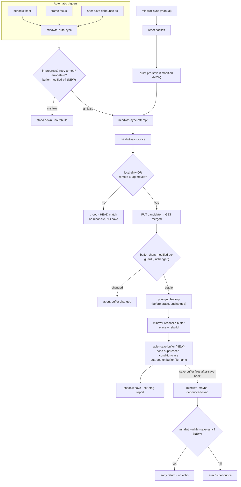

# feat: Gate auto-sync on buffer-saved state and auto-save after reconcile rebuild

## Summary

`mindwtr-reconcile-buffer` rebuilds the synced org file with a full `erase-buffer` + re-insert
after every content-changing sync. When a periodic (default 600s) or focus auto-sync fires while
the user has *stable unsaved edits*, it rebuilds the buffer out from under them mid-edit. PR #28
(issue #25) hardened scroll/fold restoration so the rebuild is less jarring; this change attacks
the **trigger side** so the disruptive rebuild largely stops firing mid-edit at all.

Two coordinated changes implement the settled behavior model:

1. **Stand down auto-sync on unsaved edits.** Periodic, focus, and the post-save debounce all
   route through `mindwtr--auto-sync`; it gains a `buffer-modified-p` gate so it skips the cycle
   whenever the synced buffer has unsaved-vs-disk edits. If the file isn't open, there are no
   unsaved edits and sync runs freely.
2. **Auto-save after a content-changing sync.** After `mindwtr-reconcile-buffer` rebuilds the
   buffer, the engine saves it back to clean — but only on the full-cycle branch that actually
   rebuilt, never on the `:noop` HEAD-match path.

The two combine to avoid self-blocking: a sync saves → buffer is clean → the next periodic sync
is free to run. The steady-state cycle is *edit → buffer dirty → auto-sync stands down → user
saves → after-save hook syncs → sync rebuilds and saves → buffer clean → free again*.

This serves the **Emacs-native editing** and **Transport & reliability** tracks in
`STRATEGY.md`: a background sync must not rebuild the buffer under an actively-editing user, and
"save = commit point" becomes the coherent trigger contract. (see origin: issue #25)

---

## Problem Frame

`mindwtr--auto-sync` (`mindwtr.el:199`) is the single entry for all automatic triggers
(periodic timer, frame focus, and the 5s post-save debounce). Today it short-circuits only on
three guards: a cycle already in progress, an armed backoff retry, or a persistent error state.
It does **not** consider whether the synced buffer has unsaved edits. So a periodic tick that
lands while the user is mid-edit calls `mindwtr--sync-attempt` → `mindwtr-sync-once`, which on
any content change runs `mindwtr-reconcile-buffer` — a full `erase-buffer` + re-insert that
discards the user's in-progress, unsaved work and reflows the buffer under them.

The engine already leaves the buffer **dirty** after a rebuild (an `erase`+`insert` always sets
the modified flag, even for byte-identical content). That was deliberate: it let the user review
the *Mindwtr Sync Report*, and if unhappy with a conflict merge, bail to the pre-sync backup
before persisting. But it also means every successful background sync leaves the buffer unsaved,
which — once we gate on `buffer-modified-p` — would permanently wedge auto-sync (the buffer is
never clean, so it always stands down). Hence the two changes are a matched pair: gating requires
auto-save to close the loop.

Two distinct "dirty" axes must not be conflated:

- **`buffer-modified-p`** — buffer contents vs the file on disk (unsaved edits). This is the
  *new gate*. A save clears it.
- **`local-dirty`** (`mindwtr-sync.el:290`) — buffer entities vs the shadow/server snapshot.
  This drives the PUT decision. A buffer that is *clean on disk* can still be local-dirty vs the
  server — that's the normal commit-on-save push path, and it must keep working untouched.

The reconcile path runs **after** the server PUT has committed and past the
`buffer-chars-modified-tick` concurrency guard (`mindwtr-sync.el:321`), so anything added here
must never throw — a write failure must not masquerade as a sync failure (AGENTS.md invariant:
"Post-PUT path must never throw").

**In scope:** the auto-sync trigger gate, the post-reconcile auto-save, the manual save-then-sync
path, and suppressing the after-save echo from the engine's own saves.

**Not in scope:** changing the reconcile rebuild strategy itself (still a full erase+rebuild),
the conflict-detection/merge logic, the backoff state machine, or incremental/signature-diffed
reconciliation (deferred — issue #5).

---

## High-Level Technical Design

The change adds one **gate** on the trigger side and one **save** on the engine side, plus an
echo-suppression flag so the engine's internal saves don't re-arm the debounce. Directional flow
(not implementation spec):

Three structural facts drive the design:

- **The two guards cover two different echo windows (the asymmetry the whole design rests on):**
  the in-flight guard (`mindwtr--sync-in-progress`) **does** absorb a periodic/focus timer or a
  previously-armed debounce that comes due *during* the engine's synchronous `save-buffer` (the
  flag is still bound `t` throughout the cycle, so any re-entrant `mindwtr--auto-sync` short-circuits).
  What it does **not** absorb is the *new* 5s *idle* debounce that `save-buffer` arms via
  `after-save-hook`: that timer fires well after the cycle ends and the guard has unwound. So the
  explicit `mindwtr--inhibit-save-sync` flag covers exactly that post-cycle idle echo, and the
  in-flight guard covers the during-cycle case. Together they close both windows; neither alone does.
- The suppression flag is read in `mindwtr.el` (`mindwtr--maybe-debounced-sync`) and bound in
  `mindwtr-sync.el` (the engine save) **and** `mindwtr.el` (the manual pre-save). Under
  `make compile` with `error-on-warn`, a special variable bound in one file and referenced in
  another must be `defvar`-declared in a file both can see. `mindwtr.el` requires
  `mindwtr-sync.el`, so the flag's `defvar` lives in `mindwtr-sync.el` (the lower layer).
- Reconcile's `erase`+`insert` **always** marks the buffer modified, even when merged content is
  byte-identical to what was there. So the post-reconcile save will write (and clean) the buffer
  on every full-cycle sync — which is exactly the intended "return to clean" outcome.

---

## Key Technical Decisions

### KTD-1: Echo suppression via a dynamic `defvar` flag, not `(let ((after-save-hook nil)) ...)`

The engine's internal `save-buffer` must not re-arm the debounce. Two options: (A) bind
`after-save-hook` to nil around the save, suppressing *all* after-save handlers for that save;
(B) a dedicated `mindwtr--inhibit-save-sync` flag that only `mindwtr--maybe-debounced-sync`
checks. **Choose (B).** It is surgical (other users' after-save handlers on the mindwtr file —
recentf, etc. — still run on the programmatic save, which is correct), it is intent-revealing,
and it mirrors the established `mindwtr--sync-in-progress` pattern (a `defvar` dynamically
`let`-bound so it auto-unwinds on any exit — never `setq`-reset). The flag is `defvar`-declared
in `mindwtr-sync.el` so both files compile clean under `error-on-warn`.
(Grounded in `docs/solutions/design-patterns/sync-reentrancy-in-flight-guard.md`.)

### KTD-2: The gate lives in `mindwtr--auto-sync`, covering all three automatic triggers

The settled spec names "periodic + focus", but all three automatic triggers (periodic, focus,
*and* the post-save debounce) funnel through `mindwtr--auto-sync`. Placing the `buffer-modified-p`
stand-down there is strictly correct and avoids a second gate site: after a save the buffer is
clean, so the debounced push runs freely; it only stands down if the user re-edited within the 5s
window — precisely when a rebuild would be disruptive. This also honors the institutional rule
"route every automatic trigger through `mindwtr--auto-sync`, never directly into the engine".
Manual `mindwtr-sync` deliberately bypasses this gate (see KTD-4).

### KTD-3: Auto-save only on the reconcile (full-cycle) branch, never on `:noop`

The `:noop` HEAD-match branch (`mindwtr-sync.el:308`) does no reconcile and touches no buffer
content, so it must not save. The save is placed in the `else` (PUT/GET/reconcile) branch,
immediately after `mindwtr-reconcile-buffer`. Because a `:noop` never rebuilds, a buffer that is
unsaved-but-not-local-dirty (e.g. a cosmetic edit) is left exactly as the user left it on the
noop path — the engine does not silently save edits it didn't cause.

### KTD-4: Manual `mindwtr-sync` is save-then-sync, and bypasses the gate

A manual sync is an explicit request, so it never refuses on unsaved edits. It saves the buffer
first (quietly, echo-suppressed), then runs the cycle. This (a) makes "save = commit point"
consistent for the manual path, (b) returns the buffer to clean even when the resulting sync is a
`:noop` (a cosmetic unsaved edit that pushes nothing still gets committed to disk and the buffer
cleaned), and (c) ensures a disk commit point exists even if the subsequent cycle aborts. The
existing `mindwtr--reset-backoff` on the manual path is preserved.

### KTD-5: The post-reconcile save must neither throw nor silently strand the user

The save runs in the post-PUT region, where the AGENTS.md invariant forbids throwing (the server
already committed; a throw would surface as a spurious sync failure and arm backoff incorrectly).
A disk-write failure in the engine save is caught (`condition-case`) so it does not throw — the
cycle still records shadow/etag and shows the report.

But "does not throw" is **not** "is safe to ignore." Two refinements the adversarial review
surfaced:

- **Silent-stall mitigation (the important one).** If the engine save fails, the buffer is left
  modified, and — because the shadow/etag were *already advanced* (`mindwtr-sync.el:332-333`) — the
  on-disk file is now stale relative to the recorded sync state, while the gate (KTD-2) will stand
  down *every* subsequent periodic/focus tick *silently*. A transient `message` is not adequate
  signal for a persistent data-divergence state, especially for a `.org` on a network/synced
  folder (Dropbox/iCloud/syncthing momentary locks are not "rare disk edge"). **On engine-save
  failure, set `mindwtr--error-state`** (the existing persistent-error mechanism: it surfaces a
  standing message, is itself a stand-down guard in `mindwtr--auto-sync`, and is cleared only by a
  manual `mindwtr-sync` — which save-then-syncs and recovers). This reuses existing machinery to
  turn a silent stall into a visible, recoverable error.
- **Non-interactive assumption.** `condition-case` catches errors but does **not** neutralize
  *interactive prompts* (a coding-system query, or a `before-save-hook`/`write-file-functions` that
  calls `y-or-n-p`). A blocking prompt mid-cycle in the post-PUT region is its own hazard. The
  engine quiet-save therefore also binds `before-save-hook` to nil (see KTD-7) and assumes the
  visited file's coding system is already established (it was just read/written), making a prompt
  effectively impossible. Document this as an assumption rather than a guarantee.

The manual pre-save (KTD-4) is wrapped in `condition-case` the same way, but is a *user* save and
does **not** set `mindwtr--error-state` (the user is present and initiated it) and does **not**
suppress `before-save-hook` (see KTD-7).

### KTD-6: Conflict-review recovery shifts from `revert-buffer` to the pre-sync backup

Today a post-sync buffer is left dirty, so a user unhappy with a conflict merge can `revert-buffer`
to discard the rebuild and recover the on-disk pre-sync state. Auto-saving removes that escape
(disk now holds post-sync content). Recovery becomes: restore from the timestamped pre-sync
backup, which is **still written before the erase** (`mindwtr-sync.el:323-330`, full-cycle branch,
guarded on `buffer-file-name`) and surfaced in the *Mindwtr Sync Report* (`mindwtr-report.el:123-124`;
the report is `display-buffer`'d when there are conflicts/skew/warnings, so on a conflict it does
pop). This is a deliberate behavior change. (Backup ordering is unchanged — never reorder
save/backup/reconcile; the backup stays strictly before the rebuild.)

**Ship-gate verification (promoted from follow-up per adversarial review):** because auto-save
removes `revert-buffer` recovery the moment U2 lands — and the resolved decision (A) auto-persists
conflict merges with no review window — confirm *before shipping* that the report surfaces the
backup path prominently enough for a non-author to recover an unwanted conflict merge without
reading source. This is the sharpest behavioral regression in the change, and under decision A the
backup is the *sole* recovery affordance, so this verification is non-negotiable.

---

### KTD-7: The engine save suppresses `before-save-hook`; the manual save does not

`before-save-hook` can mutate buffer content (`delete-trailing-whitespace`, `whitespace-cleanup`,
`org-update-all-dblocks`, time-stamp updaters, formatters). For the **engine post-reconcile save**,
the buffer holds engine-canonical reconciled content; letting a formatter mutate it would (a) run
*after* the `buffer-chars-modified-tick` guard with no re-validation, and (b) phantom-churn the
content signature so the *next* sync sees a spurious local-dirty delta and re-PUTs. So the engine
quiet-save binds `before-save-hook` to nil — it is writing the source of truth, not user-authored
text. (This is consistent with KTD-1's reasoning that *after*-save handlers should still run; the
asymmetry is deliberate — before-save formatters mutate, after-save handlers observe.) The
**manual pre-save** (KTD-4) is an ordinary user save and lets `before-save-hook` run normally, so
manual sync behaves exactly like the user pressing `C-x C-s` then syncing. Document that a
content-mutating `before-save-hook` on the synced file will, on a *manual* sync, push the
formatter's edits — which is the correct and expected behavior for a user-initiated save.

---

## Resolved Decision: auto-save on every full-cycle sync (option A)

**Should the engine auto-save on the conflict branch, or leave the buffer dirty when conflicts
were detected?** The settled model says "auto-save after a content-changing sync"; it did not
explicitly resolve the *conflict* sub-case, which the adversarial review flagged as the biggest
behavioral regression. The two options were:

- **(A) Auto-save on every full-cycle sync — CHOSEN.** Simplest, fully closes the self-wedge loop,
  and keeps one uniform save path with no conflict-vs-clean branching in the engine. The tradeoff: a
  background conflict merge (server-wins) is persisted to disk *before* the user reviews the report,
  so recovery of an overridden local edit is via the pre-sync backup only.
- (B) Auto-save only when `conflicts` is empty — *rejected.* Would have preserved today's
  review-and-revert affordance for overridden edits but at the cost of a conflict-vs-clean branch in
  the engine and a conflict sync leaving the buffer dirty.

**Consequence of choosing A:** the KTD-6 recovery regression applies in full (no review window on
background conflict merges), which makes the **ship-gate verification that the report surfaces the
backup path prominently** non-negotiable — it is now the *only* recovery affordance for an unwanted
conflict merge. U2 implements the unconditional engine save (no `conflicts` guard).

---

## Implementation Units

### U1. Echo-suppression infrastructure and debounce early-return

**Goal:** Add the `mindwtr--inhibit-save-sync` flag and a quiet-save helper that both save sites
reuse, and make the debounce scheduler honor the flag. Foundation for U2, U4, U5.

**Requirements:** Addresses the "after-save echo" wrinkle (sync's own `save-buffer` must not
schedule an extra HEAD-only sync ~5s later).

**Dependencies:** none.

**Files:**
- `mindwtr-sync.el` — add `(defvar mindwtr--inhibit-save-sync nil ...)` near the top (lower layer,
  visible to both files); add helper `mindwtr-sync--save-buffer-quietly`.
- `mindwtr.el` — early-return in `mindwtr--maybe-debounced-sync` (`mindwtr.el:236`) when
  `mindwtr--inhibit-save-sync` is set.
- `test/mindwtr-sync-test.el` — helper and flag tests.

**Approach:**
- `mindwtr-sync--save-buffer-quietly (&optional protect-content)`: operates on the current buffer;
  returns `:skipped` when `(buffer-file-name)` is nil (no-op, no error), `t` on a successful save,
  and `nil` when the inner `save-buffer` signals. Binds `mindwtr--inhibit-save-sync` to `t` around a
  `save-buffer` wrapped in `condition-case` (per KTD-5) so a write error is caught, not thrown. When
  `protect-content` is non-nil, also binds `before-save-hook` to nil (per KTD-7 — used by the engine
  save to protect canonical content; the manual pre-save calls it *without* the flag so user hooks
  run). `save-buffer` itself no-ops when the buffer is unmodified.
- `mindwtr--maybe-debounced-sync` gains a leading guard: when `mindwtr--inhibit-save-sync` is
  non-nil, return immediately without cancelling/arming the debounce timer. The flag is bound only
  for the synchronous duration of an internal `save-buffer`, during which `after-save-hook` runs
  (synchronously, before `save-buffer` returns — verified).

**Patterns to follow:** the `defvar` + dynamic-`let` discipline of `mindwtr--sync-in-progress`
(`mindwtr.el:64`) — never `setq`-reset the flag; let unwinding clear it. Wrap-must-not-throw
mirrors `mindwtr-reconcile--restore-view`'s `condition-case` rationale.

**Test scenarios:**
- `mindwtr--maybe-debounced-sync` arms a debounce timer for the mindwtr file when
  `mindwtr--inhibit-save-sync` is nil (happy path; existing behavior preserved).
- `mindwtr--maybe-debounced-sync` does **not** arm a timer and leaves any existing
  `mindwtr--debounce-timer` untouched when `mindwtr--inhibit-save-sync` is bound `t`.
- `mindwtr-sync--save-buffer-quietly` on a file-visiting modified buffer writes to disk and leaves
  the buffer unmodified.
- During that quiet save (with `mindwtr--maybe-debounced-sync` live on `after-save-hook`), no
  debounce timer is armed — the echo is suppressed.
- `mindwtr-sync--save-buffer-quietly` on a non-file buffer (`buffer-file-name` nil) is a no-op and
  does not error.
- Error path: when the inner `save-buffer` signals (override the `save-buffer` *primitive* via
  `cl-letf` on `(symbol-function 'save-buffer)`, not the helper, so the helper's `condition-case`
  catches it), the helper returns `nil`, does not throw, and the buffer remains modified.
- `protect-content` non-nil binds `before-save-hook` to nil during the save (a content-mutating
  `before-save-hook`, e.g. one that inserts text, does not run); without the flag the hook runs.

**Verification:** the helper saves file-visiting buffers cleanly, never throws, and never leaves
the suppression flag set after returning; the debounce is suppressed only while the flag is bound.

---

### U2. Auto-save the buffer after a content-changing reconcile

**Goal:** After `mindwtr-reconcile-buffer` rebuilds the buffer in the full-cycle branch, save it
back to clean using the quiet helper — never on the `:noop` branch.

**Requirements:** Behavior model #1 (auto-save after a content-changing sync). Closes the loop that
makes the KTD-2 gate non-self-blocking.

**Dependencies:** U1.

**Files:**
- `mindwtr-sync.el` — `mindwtr-sync-once`, in the `else` (PUT/GET/reconcile) branch, immediately
  after `(mindwtr-reconcile-buffer merged)` at `mindwtr-sync.el:331`; thread `:save-failed` into the
  returned plist.
- `mindwtr.el` — `mindwtr--sync-attempt` reacts to `:save-failed` by setting `mindwtr--error-state`
  (KTD-5 silent-stall mitigation; `mindwtr--error-state` lives here, so the *reaction* stays in this
  layer while the engine only *reports* failure — preserving the require direction).
- `test/mindwtr-sync-test.el`, `test/mindwtr-test.el`.

**Approach:** insert `(mindwtr-sync--save-buffer-quietly t)` (content-protected, per KTD-7) after the
reconcile call and before the existing `shadow-save`/`set-etag`/`report` steps. When it returns
`nil` (save failed), add `:save-failed t` to the result plist; the shadow/etag/report steps still
run (the PUT committed). The save is guarded internally on `buffer-file-name` (so the many
temp-buffer engine tests that don't visit a file are unaffected) and wrapped per KTD-5. In
`mindwtr--sync-attempt`, after `mindwtr--reset-backoff`, branch on `(plist-get res :save-failed)`
to set a descriptive `mindwtr--error-state` instead of the "sync ok" message. Do **not** add any
save to the `:noop` branch. Backup ordering at `mindwtr-sync.el:323-330` stays strictly before the
erase (KTD-6). The save is **unconditional** in the full-cycle branch (resolved decision A — no
`conflicts` guard); a conflict merge is auto-persisted like any other, so recovery relies on the
pre-sync backup.

**Patterns to follow:** the existing `(when (buffer-file-name) ...)` guard already used for the
pre-sync backup write — reuse the same file-visiting predicate so behavior is consistent across
backup and save.

**Test scenarios** (all engine tests that exercise the save must use a **file-visiting** buffer —
`make-temp-file` + `find-file-noselect`/`set-visited-file-name` — because the existing
`with-temp-buffer` engine tests have `buffer-file-name` nil, where the `(when (buffer-file-name) ...)`
guard skips the save and the assertion proves nothing):
- Full reconcile cycle on a file-visiting temp buffer (extend the existing
  "pulls-when-clean-but-remote-moved" / end-to-end setup with a real temp file): after
  `mindwtr-sync-once`, the buffer is unmodified and the file on disk contains the merged content.
- `:noop` branch does **not** write the file: on a **file-visiting** buffer, set up a clean-vs-server
  entity state with a HEAD-matching ETag, mark the buffer modified (`set-buffer-modified-p t`), run
  `mindwtr-sync-once`, assert `:noop` **and** that the file on disk was not rewritten (capture
  contents/mtime before and after, or spy `save-buffer`) and the buffer is still modified. (Using a
  temp buffer here would pass vacuously via the `buffer-file-name` guard — it must visit a file.)
- After-save echo is suppressed on the engine save — with `mindwtr--maybe-debounced-sync` live on
  `after-save-hook`, a full cycle leaves `mindwtr--debounce-timer` unarmed.
- During-save re-entrancy is absorbed by the in-flight guard: with a periodic/focus trigger
  simulated to fire during the engine save (call `mindwtr--auto-sync` while `mindwtr--sync-in-progress`
  is `t`), it does not launch a second cycle. (Closes the echo-asymmetry reasoning empirically.)
- `buffer-chars-modified-tick` guard has no interaction: a full cycle on a file-visiting buffer
  completes without the "buffer changed during sync; aborting" error (the save is downstream of the
  tick guard and does not bump the tick).
- Save-failure isolation + signal: when the post-reconcile `save-buffer` signals (`cl-letf` on the
  `save-buffer` primitive), `mindwtr-sync-once` still returns `:ok` (does not raise), shadow/etag are
  still updated, the buffer is left modified, the result carries `:save-failed t`, and
  `mindwtr--sync-attempt` sets `mindwtr--error-state` (verifiable: a subsequent `mindwtr--auto-sync`
  stands down on the error-state guard, and a manual `mindwtr-sync` clears it).

**Verification:** a content-changing sync of a file-visiting buffer ends with the buffer clean and
the file holding merged content; a `:noop` sync never writes; a save failure degrades to a message
without failing the sync.

---

### U3. Gate `mindwtr--auto-sync` on unsaved buffer edits

**Goal:** Auto-sync (periodic, focus, post-save debounce) stands down when the synced buffer has
unsaved edits; runs freely when the file isn't open or the buffer is clean.

**Requirements:** Behavior model #2 (periodic + focus stand down on `buffer-modified-p`).

**Dependencies:** none (independent of U1/U2, but only safe to ship *with* U2 — see sequencing).

**Files:**
- `mindwtr.el` — add predicate `mindwtr--buffer-has-unsaved-edits-p`; extend the `or` guard in
  `mindwtr--auto-sync` (`mindwtr.el:205-208`).
- `test/mindwtr-test.el`.

**Approach:**
- `mindwtr--buffer-has-unsaved-edits-p`: returns nil when `mindwtr-file` is nil; otherwise looks up
  the buffer via `find-buffer-visiting` (truename/symlink-safe, unlike `get-file-buffer`) and returns
  `(and buf (buffer-modified-p buf))`. When the file isn't open, `find-buffer-visiting` returns nil →
  no unsaved edits → sync proceeds. **Verify during implementation** that `find-buffer-visiting`'s
  truename matching is equivalent to the `file-equal-p` guard already used in
  `mindwtr--maybe-debounced-sync` for an exotic symlinked `mindwtr-file` — a false "not open" here is
  the one failure direction that defeats the feature (sync proceeds and rebuilds under the user).
- Add the predicate as a fourth disjunct in `mindwtr--auto-sync`'s existing `(unless (or ...))`,
  alongside `mindwtr--sync-in-progress`, the retry-timer check, and `mindwtr--error-state`.

**Patterns to follow:** the existing guard composition in `mindwtr--auto-sync`; the `file-equal-p`
truename handling already used in `mindwtr--maybe-debounced-sync` (`mindwtr.el:238-239`).

**Test scenarios** (the "open" buffer must be established via `find-file-noselect`/`set-visited-file-name`
on the `mindwtr-file` path so `find-buffer-visiting` actually resolves it — a bare `with-temp-buffer`
is not found):
- `mindwtr--auto-sync` does **not** call `mindwtr--sync-attempt` when the mindwtr file buffer is
  open and modified (spy `mindwtr--sync-attempt` via `cl-letf`).
- `mindwtr--auto-sync` **does** call `mindwtr--sync-attempt` when the buffer is open and clean.
- `mindwtr--auto-sync` **does** call `mindwtr--sync-attempt` when the file is not open in any buffer
  (free-to-run path).
- Existing guards still short-circuit: with `mindwtr--sync-in-progress` / an armed retry timer /
  `mindwtr--error-state` set, the cycle is skipped regardless of buffer state (no regression).
- `mindwtr--buffer-has-unsaved-edits-p` truth table: nil when `mindwtr-file` is nil; nil when the
  file isn't open; t when open + modified; nil when open + clean.

**Verification:** periodic/focus/debounce triggers skip while the buffer is dirty and resume once it
is saved or closed; the existing in-progress/retry/error guards are unchanged.

---

### U4. Manual `mindwtr-sync` becomes save-then-sync

**Goal:** A manual sync saves the synced buffer first (if modified), then runs the cycle, honoring
the explicit request without refusing.

**Requirements:** Behavior model #3 (manual sync = save-then-sync, does not refuse).

**Dependencies:** U1 (quiet-save helper).

**Files:**
- `mindwtr.el` — `mindwtr-sync` (`mindwtr.el:211`).
- `test/mindwtr-test.el`.

**Approach:** in `mindwtr-sync`, after `mindwtr--reset-backoff` and before `mindwtr--sync-attempt`,
locate the synced buffer (`find-buffer-visiting mindwtr-file`, guarded on `mindwtr-file`) and, when
it is modified, call `mindwtr-sync--save-buffer-quietly` **without** the `protect-content` flag
(per KTD-7 — a manual sync is an ordinary user save, so the user's `before-save-hook`s run, exactly
as a real `C-x C-s` would). Echo-suppressed so the pre-save does not separately arm the debounce (the
cycle is about to run anyway). The buffer is then clean on disk; `mindwtr-sync-once` parses the buffer.
**Caveat (KTD-7):** if the user has a *content-mutating* `before-save-hook` (e.g.
`delete-trailing-whitespace`), the pre-save mutates the buffer and the push reflects those edits —
correct and expected for a user-initiated save, but it means "the save changes nothing that gets
pushed" holds only in the absence of such hooks. The pre-save runs entirely upstream of
`mindwtr-sync-once`'s post-parse tick capture, so it cannot interact with the tick guard.

**Patterns to follow:** the buffer-lookup predicate from U3; the quiet-save helper from U1.

**Test scenarios:**
- `mindwtr-sync` with a modified mindwtr buffer saves it first (buffer becomes unmodified) and then
  calls `mindwtr--sync-attempt` (spy the attempt; assert the buffer is clean before it runs).
- The manual pre-save is echo-suppressed: no `mindwtr--debounce-timer` is armed by the pre-save.
- `mindwtr-sync` with an already-clean buffer performs no redundant save and proceeds to the cycle.
- `mindwtr-sync` still calls `mindwtr--reset-backoff` (existing escape-hatch behavior preserved).

**Verification:** invoking `mindwtr-sync` on a dirty buffer leaves it clean and proceeds to sync;
the manual path remains the backoff escape hatch and does not arm a redundant debounce.

---

### U5. Suppress the after-save echo in `mindwtr-bootstrap` (consistency)

**Goal:** `mindwtr-bootstrap` already saves after a reconcile rebuild; route that save through the
quiet helper so it doesn't echo a stray HEAD-only sync when `mindwtr-auto-sync-mode` is on.

**Requirements:** Completes the after-save-echo wrinkle across all engine-driven saves (the bootstrap
save is the same echo class as the sync save).

**Dependencies:** U1.

**Files:**
- `mindwtr.el` — `mindwtr-bootstrap` (`mindwtr.el:231`, the `(save-buffer)` after
  `mindwtr-reconcile-buffer`).
- `test/mindwtr-test.el`.

**Approach:** replace the bare `(save-buffer)` with `(mindwtr-sync--save-buffer-quietly t)`
(content-protected, like the engine save) inside the existing `with-current-buffer`. The echoed sync
would be a HEAD-match `:noop` (bootstrap sets shadow + etag immediately after), so this is
consistency-hardening rather than a correctness fix — but it removes a stray timer and keeps one save
path. Bootstrap is a deliberate overwrite, so leaving the buffer clean is correct here.

**Patterns to follow:** U1's helper; the existing `with-current-buffer (find-file-noselect mindwtr-file)`
block in `mindwtr-bootstrap`.

**Test scenarios:**
- After `mindwtr-bootstrap` (auto-sync-mode on, `mindwtr--maybe-debounced-sync` on
  `after-save-hook`), the buffer is saved (unmodified) and no `mindwtr--debounce-timer` is armed.

**Verification:** bootstrap leaves the file saved and arms no debounce echo.

---

## Scope Boundaries

**In scope:** the four behavior changes above (gate, auto-save, manual save-then-sync, echo
suppression) plus bootstrap echo consistency.

### Deferred to Follow-Up Work

- **`/ce-compound` capture** of two undocumented gotchas this change exercises: the cross-file
  `defvar`/`error-on-warn` free-variable rule, and the after-save self-trigger (in-flight guard does
  not absorb a 5s idle echo). Capture after this lands.
- **Rebuild-only gate refinement** (out of scope here): gate only the reconcile/rebuild step while
  permitting a HEAD/GET-only pull-detection, so a dirty local buffer no longer strands *remote* pulls
  (see the pull-blocking risk). Larger change; deferred.

> Note: "verify report surfaces the backup path" was **promoted to a ship-gate** (see KTD-6 and
> Risks), not deferred.

### Out of scope (not this change)

- Reconcile rebuild strategy (still a full erase+rebuild) and incremental/signature-diffed
  reconciliation (issue #5).
- Conflict detection/merge logic and the server-authoritative resolution.
- The backoff/retry state machine.

---

## Risks & Dependencies

- **Self-wedging gate (highest risk):** if U3 (gate) shipped without U2 (auto-save), every
  background rebuild would leave the buffer dirty and permanently stand down auto-sync. **Mitigation:**
  ship U2 and U3 together; U2 sequenced first. The matched-pair invariant is the core correctness
  property.
- **Cross-file `defvar` build break:** the suppression flag bound in `mindwtr-sync.el` and read in
  `mindwtr.el` will fail `make compile` (`error-on-warn`) if not `defvar`-declared where both see it.
  **Mitigation:** declare it in `mindwtr-sync.el` (the required/lower layer), per KTD-1; `make compile`
  is the gate.
- **Post-PUT throw / silent stall (high):** an unwrapped save failure would surface as a spurious
  sync failure and arm backoff; a *caught-but-ignored* failure leaves the buffer dirty, the disk file
  stale vs the just-advanced shadow, and the gate standing down every future tick silently.
  **Mitigation:** KTD-5 — `condition-case` wrap *and* set `mindwtr--error-state` (persistent, visible,
  manual-sync-clearable) on failure; tested in U2.
- **Stand-down stranding — two cases, only one benign:** the gate stands down on *any*
  `buffer-modified-p`, which has two distinct intersections:
  - *Benign (clean-vs-server, documented trade):* user saved, re-edited without saving, walked away;
    the earlier save is on disk + local-dirty vs server and pushes on the next clean-buffer sync. No
    loss — the intended "save = commit point" behavior.
  - *Dangerous (local-dirty-vs-server after a failed engine save):* edits live only in the in-memory
    buffer and a stale disk file, the gate disables the periodic safety net, and nothing pushes. This
    is the case the KTD-5 `mindwtr--error-state` signal exists to surface; it must not be lumped under
    the benign trade.
- **Gate blocks *pulling*, not just rebuilding (accepted bound):** the gate keys on whole-cycle
  stand-down (per the settled model), so a dirty buffer — including a *cosmetic* edit that pushes
  nothing — also blocks *pulling* remote (mobile) changes. Worst-case stranding of a remote change is
  `mindwtr-sync-interval` (default 600s) **plus** however long the buffer stays dirty; focus auto-sync
  is gated too, so tabbing away and back won't pull. Accepted because active editing implies frequent
  saves (each save's debounce pulls), and the unbounded case requires editing-without-saving-and-leaving.
  Documented here rather than mitigated; a future refinement could gate only the *rebuild* step while
  allowing HEAD/GET pull-detection (out of scope).
- **Recovery behavior change (KTD-6, ship-gate verification):** users lose `revert-buffer`-to-discard;
  recovery is via the pre-sync backup surfaced in the report. Under resolved decision A, conflict
  merges auto-persist with no review window, so the backup is the *sole* recovery path. **Verify
  report prominence before shipping** (promoted from follow-up).
- **Concurrent Emacs sessions (unstated assumption, made worse by U2):** the gate sees only the
  current process's buffer; the shadow/backups are shared on disk. U2 adds an automatic disk write
  where the buffer previously stayed dirty in memory, increasing "file changed on disk under another
  session" events and shadow/etag races. **Assumption:** a single Emacs session per `mindwtr-file`.
  State it explicitly; do not attempt multi-session coordination here.

**Sequencing:** U1 → (U2 + U3 together) → U4 → U5. U1 is the shared foundation; U2 and U3 are the
matched correctness pair; U4 and U5 are independent reuses of U1.

**Ship gate:** `make test` (offline ERT) + `make compile` (byte-compile, `error-on-warn`) before
every commit, per AGENTS.md. Remove stale `*.elc` before batch ERT runs if results look off.

---

## Sources & Research

- **Origin:** issue #25 / PR #28 (pixel-stable scroll restore) — this change is the trigger-side
  complement to that rebuild-side hardening.
- `docs/solutions/design-patterns/sync-reentrancy-in-flight-guard.md` — the `defvar` + dynamic-`let`
  guard pattern (KTD-1); confirms the in-flight guard does not absorb the 5s idle echo, so an
  explicit suppression flag is required; "route every automatic trigger through `mindwtr--auto-sync`"
  (KTD-2).
- `docs/solutions/design-patterns/preserving-buffer-view-state-across-reconcile.md` — reconcile leaves
  `buffer-modified-p` as the rebuild left it, and an `erase`+`insert` always marks the buffer modified
  even for identical content (drives U2's "always save on full cycle"); post-PUT `condition-case`
  rationale (KTD-5).
- `docs/solutions/logic-errors/reconcile-partial-update-reverts-remote-edits.md` and
  `silent-deletion-untyped-org-headings.md` — why reconcile is a full rebuild and why the pre-sync
  backup must stay strictly before the erase (KTD-6); the stale-local-re-PUT failure mode the gate
  guards against.
- `mindwtr-report.el:123-124, 152-154` — the report surfaces the backup path and is `display-buffer`'d
  on conflicts/skew/warnings (load-bearing for KTD-6's ship-gate verification).
- `AGENTS.md` — sync pipeline roles; "Post-PUT path must never throw"; `make test` + `make compile`
  ship gate; remove stale `*.elc` before ERT.
- `STRATEGY.md` — Emacs-native editing and Transport & reliability tracks.
- Code anchors: `mindwtr.el` (`mindwtr--auto-sync` :199, `mindwtr-sync` :211, `mindwtr--maybe-debounced-sync`
  :236, `mindwtr-auto-sync-mode` :245, `mindwtr--on-focus` :263, `mindwtr-bootstrap` :219);
  `mindwtr-sync.el` (`mindwtr-sync-once` :273, `:noop` branch :308, reconcile branch :310-336, backup
  write :323, tick guard :321).

External research: not run — this is internal Emacs/elisp trigger behavior with strong local patterns
and institutional learnings; no external dependency or unsettled option set.
