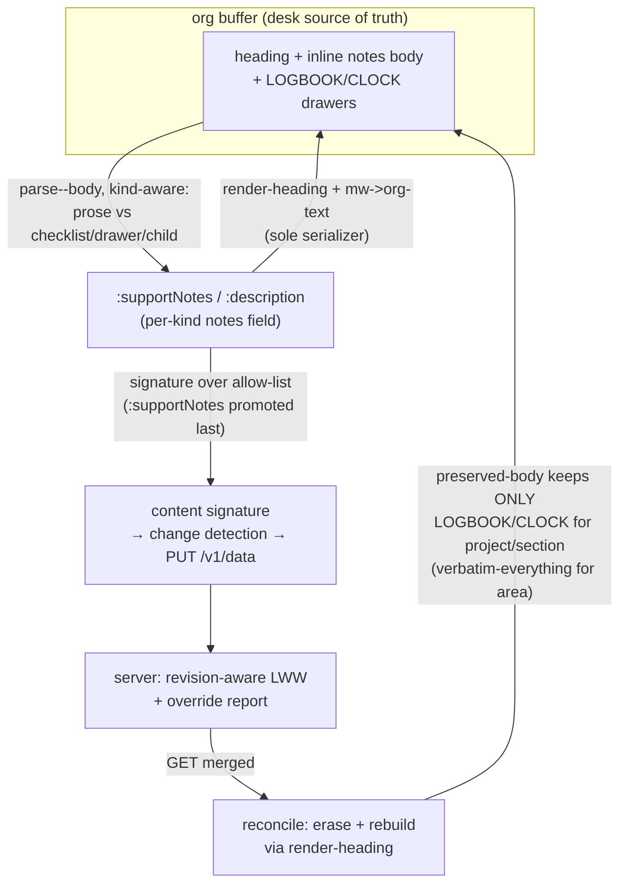

# feat: Sync project & section notes

## Summary

Make project and section notes first-class, round-tripped content in the org
file: rendered inline under the entity heading like task descriptions, parsed
back out so desk edits sync, and reconciled safely. Conflict handling reuses the
existing server-authoritative model. The work lands as a coupled render + parse +
reconcile change, a byte-stability oracle that gates a model change, and the
`:supportNotes` allow-list promotion done last.

---

## Problem Frame

mindwtr treats the single org file as the source of truth at the desk, but
note-bearing content on non-task entities never reaches the buffer.
`mindwtr-render-heading` gates body-prose emission to `kind = task`
(`mindwtr-render.el:176-182`). Projects carry notes in `:supportNotes`, kept only
in the shadow snapshot and excluded from the content-field allow-list, so they
are invisible and uneditable in Emacs. Sections carry `:description`, which is
already an allow-listed content field but is never rendered. A user who keeps the
org file as their source of truth cannot see or edit a project's notes without
switching to mobile — directly against the product's premise.

This is also the first synced field where a lost edit is a paragraph of real
prose rather than a flipped scalar, which raises the stakes on round-trip
byte-stability and on not corrupting content during reconcile.

---

## Requirements

Carried from the origin requirements doc (see origin:
`docs/brainstorms/2026-06-04-sync-project-notes-requirements.md`). R-IDs are
preserved from that document.

**Visibility & editing**

- R1. A project's notes render as inline body prose under the project heading, in
  the same position/shape as a task description. → U1
- R2. A section's notes render as inline body prose under the section heading. → U1
- R3. Edits to project/section notes in the buffer are parsed back and proposed to
  the server on the normal save-then-sync cycle — no new trigger. → U1 (parse
  extraction, both kinds); U3 (project change-detection via promotion — section is
  already allow-listed)
- R4. Project notes participate in change detection as synced content (promoted
  from shadow-only); an edit is detected, an unchanged note produces no spurious
  change. → U3

**Round-trip fidelity**

- R5. Note text is byte-stable across render → parse → render; an unedited note
  never phantom-churns the content signature. → U2
- R6. Non-ASCII note content round-trips unchanged. → U2, U4
- R7. Markdown↔org link conversion in notes reuses the existing converters and is
  its own inverse. → U2
- R8. An empty/absent note and an empty-string note are equivalent — no body, no
  phantom change. → U2

**Parse boundaries**

- R9. For projects and sections, a `- [ ]` line within notes is preserved as
  literal prose and round-trips unchanged; it is not reclassified as a checklist. → U1
- R10. Drawers, planning lines, and clock entries on a project/section heading are
  preserved across a sync and not absorbed into or displaced by notes prose. → U1

**Conflict & safety**

- R11. When the server overrides a local note edit, the override is surfaced in the
  sync report like other overridden fields — named, not silently dropped, not
  specially diffed. → U3 (no new code; `:supportNotes` flows into the existing
  report via the allow-list)
- R12. Any note content the parser cannot place is quarantined under
  `* Sync Failures`, never dropped. → U4 (existing guarantee; regression only)

---

## Key Technical Decisions

- **Reuse the existing link converters; write no new text transform.** Notes flow
  through `mindwtr-render--mw->org-text` (`mindwtr-render.el:54-71`) and
  `mindwtr-parse--org->mw-text` (`mindwtr-parse.el:92-110`) — the same mutual
  inverses task descriptions use today. They already handle labelled/label-less
  links, parens-URLs, empty-label collapse to canonical `[[url]]`, and the
  test-pinned `]`-in-path limitation. Inventing a new transform risks a
  non-self-inverse that phantom-churns the signature and lets Emacs win every LWW
  merge (see origin learnings; `docs/solutions/logic-errors/org-markdown-link-conversion-roundtrip.md`).

- **`mindwtr-render-heading` stays the sole serializer, and `preserved-body` is
  de-opaqued in the same change.** `mindwtr-reconcile--preserved-body`
  (`mindwtr-reconcile.el:45-76`) returns the *entire* non-task body verbatim
  today. The moment render emits notes, render and preserved-body both claim the
  same bytes → the note appears twice (double-graft). The render-emit and the
  preserved-body narrowing must land together; this is why U1 couples render,
  parse, and reconcile rather than splitting them (`docs/solutions/logic-errors/reconcile-partial-update-reverts-remote-edits.md`, rated critical).

- **Promote `:supportNotes` to the content-field allow-list LAST.** Adding a field
  to `mindwtr-model-content-fields` (`mindwtr-model.el:150-164`) before byte-stable
  round-trip is proven is the documented mistake that drove 30/32 entities to
  false-drift every sync (`docs/solutions/design-patterns/content-signature-allow-list-not-deny-list.md`).
  U3 makes the allow-list edit only after U2's oracle is green. Section
  `:description` is already allow-listed, so it needs no model change.

- **Section `:description` must not clobber a mobile-authored value on first
  parse.** `:description` is already allow-listed and signed, but parse does not
  populate it for sections today, so a section's local entity has `:description`
  absent while the shadow carries the server's value. Once U1 parses it from the
  rendered body, the rendered-then-parsed value must equal the server value so
  write-merge classifies the section *unchanged* and echoes the shadow — a first
  sync that parsed an empty body must not PUT an empty description over a value
  authored on mobile. U1 carries a populated-section sync fixture for this, and
  implementation must first confirm whether pre-U1 behavior already clobbers
  populated section descriptions (see Open Questions).

- **Parse partition is kind-aware so non-task checkboxes stay prose.**
  `mindwtr-parse--body` (`mindwtr-parse.el:112-136`) diverts every `- [ ]` line
  into `:checklist`. Projects/sections have no `:checklist` field, so for those
  kinds a checkbox line must stay in the prose partition (R9), or it would be
  silently amputated on the next sync. The checklist reclassification stays
  task-only.

- **Conflicts reuse the existing model; a one-time re-baseline is expected.** Notes
  ride server-authoritative revision-aware LWW and the existing override report —
  no merge, diff, or recovery. On the first sync after `:supportNotes` joins the
  allow-list, projects that already have server notes will sign differently and
  bump revision once. This is correct (the notes now legitimately round-trip) and
  accepted; no migration is built.

The note-bearing field per kind (read by render, parse, and preserved-body):

| Kind | Notes field | In allow-list? | Action |
|---|---|---|---|
| Task | `:description` | yes | unchanged |
| Section | `:description` | yes | render + parse (no model change) |
| Project | `:supportNotes` | no → **yes (U3)** | render + parse + promote last |
| Area | — | — | out of scope; preserve body verbatim |

---

## High-Level Technical Design

The feature closes the round-trip loop for project/section notes. The per-kind
field selection sits at the render and parse seams; the load-bearing safety seam
is preserved-body, which must stop carrying prose the renderer now emits.

The double-graft hazard lives on the `REC → B` edge: before this change,
preserved-body re-grafts the full non-task body after `:END:` while render emits
nothing; after it, render emits the note and preserved-body must keep only
genuinely org-only content (drawers/clock) for project/section.

---

## Implementation Units

### U1. Round-trip project & section notes through the buffer (render + parse + reconcile)

**Goal:** Project and section notes render inline as body prose, parse back into
`:supportNotes`/`:description`, and survive reconcile without double-grafting.
This is one coupled change — landing render-emit, parse-extract, or the
preserved-body narrowing alone leaves a corrupting/edit-losing intermediate state.

**Requirements:** R1, R2, R3 (parse half), R9, R10.

**Dependencies:** none (first unit).

**Files:**
- `mindwtr-render.el` — generalize the body gate at lines 176-182.
- `mindwtr-parse.el` — kind-aware prose extraction; lift the prose half of
  `mindwtr-parse--body` out of the task-only block (around 217-247).
- `mindwtr-reconcile.el` — make the non-task branch of
  `mindwtr-reconcile--preserved-body` (45-76) kind-aware.
- `test/mindwtr-render-test.el`
- `test/mindwtr-parse-test.el`
- `test/mindwtr-reconcile-test.el`

**Approach:**
- Render: introduce a helper that maps kind → notes field (`task`/`section` →
  `:description`, `project` → `:supportNotes`, `area` → nil). Emit
  `mindwtr-render--mw->org-text` of that field's value as body for any kind whose
  field is non-empty; keep the `:checklist` push behind `(eq kind 'task)`. All
  emission stays inside `mindwtr-render-heading`, which both full-rebuild
  (`mindwtr-render--entity`) and single-entry rebuild
  (`mindwtr-reconcile--rebuild-entry`) route through.
- Parse: for section set `:description (car body)`, for project set
  `:supportNotes (car body)`. The checklist regex must not divert `- [ ]` lines
  for non-tasks — those stay in the prose partition (R9). Drawers, planning lines,
  and child subtrees remain excluded (child exclusion is already structural via
  `outline-next-heading`).
- Reconcile: task/project/section preserve only LOGBOOK/CLOCK drawers + bare CLOCK
  lines (reuse the existing task-branch logic at 56-76); `area` keeps the
  preserve-everything branch. Keep both callers consistent —
  `mindwtr-reconcile--collect-org-only` (118-134) also calls `--preserved-body`.

**Patterns to follow:** the task-branch drawer/CLOCK scan in `--preserved-body`;
the existing `(eq kind 'task)` body emission in `render-heading`; the org-only
graft point `mindwtr-render--graft-org-only` (`mindwtr-render.el:241-249`).

**Test scenarios:**
- Covers R1. A project entity with `:supportNotes` renders the notes as body prose
  after `:END:`, before any child task heading.
- Covers R2. A section entity with `:description` renders its notes as body prose.
- A task still renders `:description` then checklist; checklist unchanged.
- Covers R9 / AE2. A project whose `:supportNotes` contains a `- [ ]` line parses
  that line back into `:supportNotes` as literal text — no `:checklist` key is set
  on the project.
- Section/project prose parses into the correct field; a child subtree under the
  project is excluded from the parsed notes.
- Covers R3 (section). A section that already has a server `:description`, with a
  matching rendered body, parses back to the same value so write-merge classifies
  it unchanged — the first post-U1 sync emits no empty-description PUT. No
  sync-path fixture exercises a populated section `:description` today; add one.
- Covers R10 / AE3. A project heading with a LOGBOOK drawer and notes: after a
  reconcile rebuild the drawer survives intact and the notes render once.
- No double-graft: reconcile a project whose merged appdata carries
  `:supportNotes`; the note body appears exactly once (update the existing
  `mindwtr-reconcile-update-preserves-project-prose`,
  `test/mindwtr-reconcile-test.el:193-214`, to put the prose in `merged`'s
  `:supportNotes` and assert single emission).
- `area` body is still preserved verbatim (regression).

**Verification:** `make compile && make test` green (clear `*.elc` first); project
and section notes visible and editable in a scratch buffer round-trip; the updated
reconcile test asserts single emission.

### U2. Byte-stability round-trip oracle for notes

**Goal:** Prove render→parse→render byte-stability and signature stability for
project/section notes across links, empty/nil, and non-ASCII, so the U3 allow-list
promotion is gated on green tests rather than hope.

**Requirements:** R5, R6, R7, R8.

**Dependencies:** U1.

**Files:**
- `test/mindwtr-roundtrip-test.el`

**Approach:** Clone `mindwtr-roundtrip-description-links-stable`
(`test/mindwtr-roundtrip-test.el:154-178`) for project `:supportNotes` and section
`:description`. Extend `mindwtr-roundtrip-appdata-signature-stable` (125-152) with
a notes-bearing project and section in the fixture. Add a project/section-shaped
wrapper alongside the existing task-oriented `mindwtr-roundtrip--wrap` (16-23) if
the level-2 task wrapper doesn't fit project-under-`* Projects` /
section-under-project nesting. For non-ASCII, assert representation
(`multibyte-string-p`) in addition to `string=`, per the encoder-symmetry learning
— equality alone passes a symmetric-corruption bug.

**Test scenarios:**
- Covers R5. `render == render(parse(render(x)))` byte-identical for a project note
  and a section note.
- Covers R7. Labelled link, label-less link, parens-URL link, and link-free prose
  each round-trip byte-identical in a project note (mirror the description suite).
- Covers R8. A nil/absent note and an empty-string note both render no body and
  produce no signature change; an unedited note preserves the content signature
  across render→parse.
- Covers R6 / AE1. A non-ASCII note (em-dash, curly quotes, bullet) round-trips
  byte-identical AND remains a multibyte string; the appdata signature is unchanged
  when the note is unedited.

**Verification:** the new round-trip and signature-stability tests pass; failing
any of them blocks U3.

### U3. Promote `:supportNotes` to the content-field allow-list (last)

**Goal:** Make project notes participate in change detection, write-merge, and the
override report by adding `:supportNotes` to `mindwtr-model-content-fields` — only
after U2 is green.

**Requirements:** R3 (project edit detection), R4, R11.

**Dependencies:** U2 (allow-list LAST rule — do not land before the oracle passes).

**Files:**
- `mindwtr-model.el` — add `:supportNotes` to `mindwtr-model-content-fields`
  (150-164).
- `test/mindwtr-model-test.el` — fix the assertion at 100-102.
- `test/mindwtr-signature-test.el` — confirm/flip the `:supportNotes "s"` fixture
  at line 31.

**Approach:** Single allow-list edit. Signature
(`mindwtr-signature--canonical-plist`, `mindwtr-signature.el:59`), write-merge
(`mindwtr-sync--merge-content`), and report field-diff (`mindwtr-report--field-diff`)
all read the same list and update in lockstep — no per-consumer change needed. A
plain string falls through the default canonicalization, same as `:description`.
The model test at 100-102 asserts every content field (except `:name`) is a known
*task* key; `:supportNotes` is a project key, so add it to that exclusion (or relax
to "known for at least one kind"). `:supportNotes` was never in
`mindwtr-model-shadow-only-fields`, so no change there.

**Test scenarios:**
- Covers R4. A project with `:supportNotes` signs differently from an otherwise
  identical project without it; editing the note changes the signature; an
  unedited note does not.
- Covers R3. After promotion, a buffer edit to project notes is detected by
  `mindwtr-sync--merge-content` and adopted into the candidate; an empty local note
  clears the value.
- Covers R11 / AE4. A server-overridden project note appears in the override
  report's field diff (verify `:supportNotes` is included now that it is a content
  field).
- The updated model-test assertion passes; the signature-test fixture asserts
  `:supportNotes` is included.

**Verification:** `make compile && make test` green; manual: edit a project note,
sync, observe the candidate PUT carries it; observe a server override is reported.

### U4. Regression hardening: reflow, no-double-graft, drift guard, non-ASCII smoke

**Goal:** Lock in the safety properties that span the feature — view-state stays
stable when a note grows, notes never double-emit, a future note-bearing kind that
isn't taught to render fails loudly, and non-ASCII is exercised online.

**Requirements:** R6 (online), R12.

**Dependencies:** U1 (and U3 for the report/promotion-aware checks).

**Files:**
- `test/mindwtr-reconcile-test.el`
- `test/mindwtr-parse-test.el` (drift guard, beside the existing role-coverage guard)
- smoke coverage (`make smoke-write` path; non-ASCII note)

**Approach:** Add a reconcile regression that a project/section whose note grows in
length keeps the read row stable (the `:anchor-line` screen-row path from earlier PRs absorbs body-length changes — assert it still holds for inline notes).
Add a no-double-graft regression that two successive reconciles emit the note
exactly once. Mirror the `mindwtr-parse-infer-kind-covers-every-entity-role`
drift-guard pattern (`test/mindwtr-parse-test.el:396-416`) with a guard asserting
every notes-bearing kind renders+parses its notes field, so a new kind fails a
test rather than silently dropping its body. The drift guard is optional
forward-insurance — it traces to no single R-ID but mirrors the existing
role-coverage guard; defer it to a follow-up if you'd rather add it when a third
note-bearing kind appears. Add a non-ASCII note to the `make smoke-write` path per
AGENTS.md (symmetric encoder bugs pass offline equality round-trips).

**Test scenarios:**
- A project whose note grows by several lines keeps the anchor heading's screen row
  stable across reconcile (view-state regression).
- Covers R12. A clean sync of a project/section with notes produces no
  `* Sync Failures` quarantine.
- No-double-graft: two reconciles in a row leave the note emitted exactly once.
- Drift guard: removing notes handling for a kind (simulated) fails the
  coverage test.
- Smoke (online, manual): a non-ASCII project note round-trips through a real PUT
  and remains multibyte.

**Execution note:** the smoke scenario is online-only (`make smoke-write`,
staging) and is not part of the offline `make test` gate.

**Verification:** offline regressions green in `make test`; smoke scenario
exercised manually against staging before shipping.

---

## Scope Boundaries

**In scope:** project (`:supportNotes`) and section (`:description`) notes —
render, parse, reconcile, signature/change-detection, and the existing override
report.

**Outside this product's identity (carried from origin):**
- Area notes — no synced notes/description field exists.
- Prose-aware override reporting (showing overwritten text for paste-back) — the
  existing override report is sufficient.

**Deferred for later (carried from origin):**
- Three-way prose merge using the shadow as a common ancestor.
- Read-only-first rollout as an intermediate shipping mode (collapsed into full
  round-trip).

**Deferred to follow-up work:**
- Task-side checkbox-vs-checklist earmark convention — tracked in issue #25.

---

## System-Wide Impact, Risks & Mitigation

- **False-drift storm (critical, mitigated).** Promoting `:supportNotes` before
  byte-stable round-trip is proven is the documented 30/32 false-drift bug.
  Mitigation: U3 is gated on U2's green oracle; the allow-list edit is the last
  code change.
- **Double-graft / content corruption (critical, mitigated).** Render emitting
  notes while preserved-body still carries them verbatim emits the note twice.
  Mitigation: U1 couples render + preserved-body in one change with a
  single-emission regression.
- **Section `:description` first-sync clobber (P1, must verify).** Section
  `:description` is signed but unparsed today, so the first sync after U1 starts
  parsing it could PUT an empty value over a mobile-authored description if the
  rendered/parsed round-trip isn't exact. Mitigation: the populated-section sync
  fixture in U1 plus an explicit pre-U1 behavior check (Open Questions).
- **U1–U3 release coupling (ship together).** Between U1 (parse populates
  `:supportNotes`) and U3 (allow-list promotion), a project-note edit is parsed but
  dropped by write-merge because `:supportNotes` is not yet a content field —
  silently losing the edit with no error or quarantine. U1, U2, and U3 must reach
  users as one bundle; only U4 may land separately.
- **One-time signature re-baseline (accepted).** First sync after U3 bumps
  revision once for projects that already have server notes. Correct and expected;
  no migration built. Surfaced to and confirmed by the user. This is per-client;
  the deployment is one Emacs desk plus server-authoritative mobile, so staggered
  multi-client re-baselining is not a concern.
- **Phantom-churn from a non-inverse transform (mitigated).** Avoided by reusing
  the existing self-inverse converters and proving stability in U2 (including
  parens-URL and `]`-in-path pins).
- **Non-ASCII false-green (mitigated).** Offline equality round-trips pass
  symmetric-corruption bugs; U2 asserts `multibyte-string-p` and U4 adds an online
  smoke note.
- **View-state reflow (low, regression-covered).** Inline notes change body length;
  earlier PRs's screen-row anchor already absorbs this. U4 adds a regression.

---

## Open Questions

- **Does a section with a populated server `:description` get clobbered to empty
  on each sync today (pre-U1)?** Section `:description` is already allow-listed and
  signed but never parsed, so the local candidate's `:description` is absent while
  the shadow holds the server value — write-merge could already be clearing it.
  Resolve during U1: it determines whether U1 prevents a *new* regression or fixes
  an *inherited* bug. Either way U1 adds the populated-section sync fixture; the
  framing and any backfill note depend on the answer.

---

## Sources & Research

- Origin: `docs/brainstorms/2026-06-04-sync-project-notes-requirements.md`;
  upstream ideation: `docs/ideation/2026-06-04-sync-project-notes-ideation.md`.
- Code seams: `mindwtr-render.el` (`render-heading` 97-183, body gate 176-182,
  converters 54-71, graft 241-249); `mindwtr-parse.el` (`parse--body` 112-136,
  checklist regex 129-132, task gate 217-247, converter 92-110);
  `mindwtr-reconcile.el` (`--preserved-body` 45-76, `--collect-org-only` 118-134,
  `--rebuild-entry` 78-116, `reconcile-buffer` 431-476, quarantine 376-429);
  `mindwtr-model.el` (`content-fields` 150-164, `known-fields` 171-197);
  `mindwtr-signature.el` (`--canonical-plist` 46-69).
- Tests: `test/mindwtr-roundtrip-test.el` (links-stable 154-178, appdata-signature
  125-152, wrappers 16-30); `test/mindwtr-reconcile-test.el`
  (preserves-project-prose 193-214); `test/mindwtr-model-test.el` (100-102);
  `test/mindwtr-signature-test.el` (31); `test/mindwtr-parse-test.el` (kind-coverage
  guard 396-416).
- Learnings: `docs/solutions/design-patterns/content-signature-allow-list-not-deny-list.md`;
  `docs/solutions/logic-errors/org-markdown-link-conversion-roundtrip.md`;
  `docs/solutions/logic-errors/reconcile-partial-update-reverts-remote-edits.md`;
  `docs/solutions/logic-errors/silent-deletion-untyped-org-headings.md`;
  `docs/solutions/design-patterns/preserving-buffer-view-state-across-reconcile.md`;
  `docs/solutions/integration-issues/json-encoding-gotchas-emacs-server-boundary.md`.
- Conventions: `AGENTS.md` (Emacs 28.1/Org 9.5 floor, round-trip byte-stability,
  safe-by-default reconcile, post-PUT no-throw, `make test`/`make compile`/`make
  smoke`).
