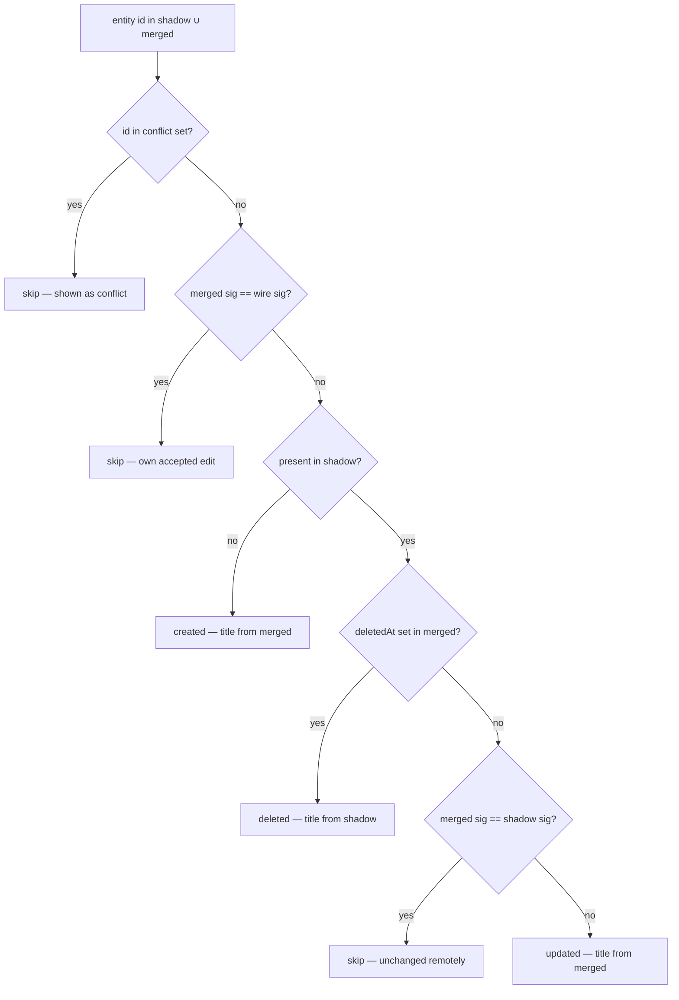
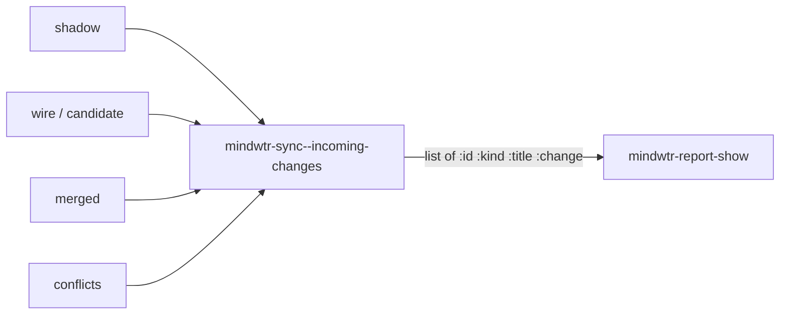

# feat: Show incoming remote changes in an append-only sync report log

## Summary

Add an "incoming from remote" section to the *Mindwtr Sync Report* — per-entity
lines for what mobile created, updated, or deleted since the last sync — and turn
the report from a replace-every-sync buffer into an append-only, org-structured
log keyed by sync time. The incoming set is derived from a content-signature
comparison of the pre-sync Shadow against the post-sync merged result, excluding
the device's own accepted edits and anything already reported as a conflict.

---

## Problem Frame

The sync report tells the user what they proposed and which of their edits the
server overrode (conflicts), but a remote change to an entity the user did not
touch lands silently — it is not a conflict, so nothing surfaces. Learning that
mobile renamed a task or deleted a project requires diffing the Shadow against
the merged result by hand. This is the soft spot in the product's "no surprises"
guarantee (see origin: `docs/brainstorms/2026-06-09-incoming-remote-changes-requirements.md`).

The data needed is already in hand at report time. In the full-cycle branch of
`mindwtr-sync-once` (`mindwtr-sync.el`), `shadow` (pre-sync baseline), `wire`
(the candidate this device pushed), and `merged` (post-sync server result) are
all live bindings. The work is to compute the incoming set from them, render it,
and redesign the report buffer to accumulate history rather than overwrite it.

---

## Requirements

Traceability is to the origin requirements doc (R1–R9, AE1–AE5).

**Incoming changes**

- R1. Surface remote changes to entities the user did not edit locally as
  per-entity lines (title + kind) under an "incoming from remote" section
  (origin R1).
- R2. Classify each line created / updated / deleted: create = present in
  `merged`, absent from `shadow`; delete = tombstoned (`:deletedAt`) in `merged`,
  live in `shadow`; update = any other content-signature difference (origin R2).
- R3. Exclude the device's own accepted edits — an entity whose `merged`
  signature equals the pushed `wire` signature is not incoming (origin R3).
- R4. Exclude entities already reported as conflicts; they appear only in the
  conflict section (origin R4).

**Append-only log**

- R5. Each sync worth reporting appends a new top-level org heading stamped with
  the sync time rather than erasing prior content (origin R5).
- R6. A sync with nothing to report (the HEAD-match no-op, or a full cycle whose
  proposed/incoming/conflict/skew/warning sets are all empty) appends no heading
  (origin R6).
- R7. The log persists for the buffer's lifetime; killing the buffer starts a
  fresh log on the next sync. The buffer is in-memory only, never written to disk
  (origin R7).

**Restore behavior**

- R8. The restore action stays live only on the most recent sync's conflict
  blocks; older sync headings are read-only history with no restore affordance
  (origin R8).
- R9. When the report pops for an actionable event (conflict, skew, warning),
  point lands on the newest sync entry (origin R9).

---

## Key Technical Decisions

- KTD1. **Compute the incoming set from the whole-entity content signature, not a
  hand-rolled field list.** `mindwtr-signature` already covers exactly the
  round-trippable allow-list fields. A parallel field enumerator would drift
  behind the schema and silently under-report — the documented failure mode in
  `docs/solutions/logic-errors/reconcile-partial-update-reverts-remote-edits.md`.
  The new helper mirrors `mindwtr-sync-detect-conflicts` (`mindwtr-sync.el:260`):
  iterate ids, look entities up with `mindwtr-sync--find-entry`, compare
  signatures.

- KTD2. **Partition by exclusion order, not a fresh diff.** The own-edit
  exclusion is the primary gate: an entity whose `merged` signature equals the
  pushed `wire` signature is the user's own accepted edit (including the user's
  own creates, which are present in `wire`) and is skipped. The conflict-id set
  is excluded first. Only then is genuine remote divergence classified — so the
  `merged`-vs-`shadow` comparison runs against an existing shadow entity, never a
  nil one. This reuses the same `shadow`/`wire`/`merged` bindings the conflict
  path already consumes, and mirrors `mindwtr-sync-detect-conflicts`' "compare
  only when both sides exist" guard (`mindwtr-sync.el:270`).

- KTD3. **Cold start suppresses incoming.** When the pre-sync `shadow` holds no
  entities across any list, the incoming set is empty — the first sync is an
  initial population, not "changes since last sync." A freshly provisioned
  Namespace makes this a real case (see `CONCEPTS.md` Namespace). The origin did
  not address cold start; this plan resolves it by treating an empty shadow as
  "no prior baseline, therefore no incoming changes."

- KTD4. **The report buffer derives from `org-mode`, read-only, with `r`
  rebound.** (Resolves the origin planning question: org-mode vs special-mode
  coexistence with the restore keymap.) Native folding and heading fontification
  carry the timestamped log for free; the alternative (`special-mode` +
  `outline-minor-mode`) reimplements what org already does. The current
  `(set-keymap-parent m special-mode-map)` must be dropped so the report keymap
  inherits `org-mode-map` through the derived-mode chain (otherwise TAB /
  `org-cycle` folding is shadowed); `r` then overrides org's binding on that key.
  Fold operations must use the version-safe dispatch required by `AGENTS.md`
  (`org-fold-*` is Org 9.6+; fall back to `outline-*`). Folding does not modify
  buffer text, so it works in a read-only buffer.

- KTD5. **Append newest-last; de-tag prior entries' restore affordance on each
  append.** (Resolves the origin planning question: heading ordering and the
  quiet-append resting position.) Each new sync entry is inserted at point-max.
  The `'mindwtr-conflict` text property that drives restore is stripped from all
  prior content when a new entry is appended, so `r` on an old block hits the
  existing "point is not on a conflict" `user-error` (R8) for free. Point moves
  to the newest entry only on an actionable pop (R9); a quiet append leaves the
  user's point and scroll untouched.

- KTD6. **The report render is wrapped in `condition-case`.** It runs in the
  post-PUT must-not-throw region (`docs/solutions/design-patterns/save-as-sync-commit-point.md`):
  the server has already committed and the shadow is saved, so a rendering hiccup
  must not surface as a spurious sync failure. Mirror the
  `mindwtr-sync--save-buffer-quietly` discipline.

- KTD7. **A shared title resolver replaces the inline `(or :title :name)` idiom.**
  task/project/section carry `:title`; area carries `:name`. For deletes the
  title is resolved from the `shadow` entity (the `merged` tombstone may not
  retain a readable title); for create/update it comes from the `merged` entity.

---

## High-Level Technical Design

Per-entity classification for the incoming set (applied to the union of `shadow`
and `merged` entity ids, after the cold-start guard):

The own-edit gate (`merged == wire`) precedes the present-in-shadow test so a
locally-created entity — present in `wire`, absent from `shadow` — is excluded
rather than mislabeled `created`. The `merged`-vs-`shadow` comparison runs only
on the present-in-shadow branch, so it never compares against a nil shadow
entity (the all-empty-remote-create false-skip).

Data flow within the full-cycle branch of `mindwtr-sync-once`:

---

## Implementation Units

### U1. Shared entity-title resolver

- **Goal:** One place that maps an entity to its human-readable label.
- **Requirements:** Supports R1 (per-entity lines need titles).
- **Dependencies:** none.
- **Files:** `mindwtr-model.el`, `test/mindwtr-model-test.el`.
- **Approach:** Add `mindwtr-model-entity-title` returning `(or (plist-get e :title) (plist-get e :name))`. The incoming helper (U2) and report renderer (U3) consume it. Do **not** touch the live inline idiom at `mindwtr-render.el:124` — unifying that call site is unrelated to this feature and carries render-regression risk for no functional gain; leave it as optional follow-up cleanup with its own safety net.
- **Patterns to follow:** existing small accessors in `mindwtr-model.el` (e.g. `mindwtr-model-notes-field`).
- **Test scenarios:**
  - task / project / section entity → returns its `:title`.
  - area entity → returns its `:name`.
  - entity with neither key → returns nil.
- **Verification:** `make test` passes; `make compile` clean.

### U2. Incoming-changes computation helper

- **Goal:** Produce the incoming-remote-changes list from `shadow`, `wire`, `merged`, and the conflict set.
- **Requirements:** R2, R3, R4; KTD1, KTD2, KTD3, KTD7.
- **Dependencies:** U1.
- **Files:** `mindwtr-sync.el`, `test/mindwtr-sync-test.el`.
- **Approach:** Add `mindwtr-sync--incoming-changes (wire merged shadow conflicts)` returning a list of `(:id :kind :title :change)` plists where `:change` is one of `created`/`updated`/`deleted`. Iterate the union of `shadow` and `merged` entity ids; look entities up with `mindwtr-sync--find-entry` (returns `(KIND . ENTITY)`; take the car for `:kind`, the cdr for the entity). Apply the classification in High-Level Technical Design **in that exact order** — conflict-id set, then own-edit (`merged` sig == `wire` sig), then present-in-shadow, then tombstone, then `merged`-vs-`shadow` — so an own-create is excluded and the shadow comparison never runs on a nil entity. Return nil when `shadow` has no entities across any list (cold-start guard). Resolve `:title` via `mindwtr-model-entity-title` from `merged` (create/update) or `shadow` (delete). Build the conflict-id set once from the `conflicts` plists.
- **Patterns to follow:** `mindwtr-sync-detect-conflicts` (`mindwtr-sync.el:260`) for the iterate-and-compare shape; `mindwtr-signature` equality as in `mindwtr-sync--classify` (`mindwtr-sync.el:121`).
- **Test scenarios:** (literal `shadow`/`wire`/`merged`/`conflicts` plists, no buffer/API — mirror the `detect-conflicts` unit tests)
  - Covers AE1. Untouched task changed in `merged` (≠ shadow, ≠ wire) → one `updated` line; the user's own won edit (`merged` == `wire`) → not present.
  - Covers AE2. Entity tombstoned in `merged`, live in `shadow` → `deleted` line; title resolved from `shadow`.
  - Remote create: id in `merged`, absent from `shadow` → `created`; title from `merged`.
  - Covers AE3. Id present in the conflict set → excluded from incoming.
  - Entity whose `merged` signature equals its `shadow` signature → excluded (unchanged remotely).
  - Locally-created entity (present in `wire`, absent from `shadow`, `merged` == `wire`) → excluded as own edit, not reported as `created`.
  - Remote create whose content fields are all empty → reported as `created`, not skipped (the `merged`-vs-`shadow` gate must not run against the nil shadow entity).
  - Empty `shadow` (cold start) → returns nil even when `merged` is populated.
  - `:kind` is set correctly for each of task/project/section/area.
- **Verification:** unit tests green for every classification and exclusion branch.

### U3. Append-only org-structured report buffer

- **Goal:** Render the report as an accumulating org log with an incoming-from-remote section, restore live only on the newest entry.
- **Requirements:** R1, R5, R6, R7, R8, R9; KTD4, KTD5, KTD6.
- **Dependencies:** U1 (title rendering); consumes the plist shape from U2.
- **Files:** `mindwtr-report.el`, `test/mindwtr-report-test.el`.
- **Approach:**
  - Change `mindwtr-report-mode` to `define-derived-mode ... org-mode`; keep the `"r"` → `mindwtr-report-restore-conflict` binding but **drop** the existing `(set-keymap-parent m special-mode-map)` (`mindwtr-report.el:49`) so the keymap inherits `org-mode-map` through the derived-mode chain and TAB / `org-cycle` folding stays live; `r` overrides org's binding on that key. Set the buffer read-only (writes under `inhibit-read-only`). Bind `org-inhibit-startup` when initializing. Use version-safe fold calls per `AGENTS.md` if any folding is applied on display.
  - Extend `mindwtr-report-show` with a trailing optional `incoming-changes` parameter and a sync-time argument (or stamp via `format-time-string` like the backup path at `mindwtr-sync.el:402`).
  - Replace erase-and-rebuild with: initialize the buffer once (static title header) when it is freshly created (detected by mode/empty buffer — satisfies R7, since a killed buffer is recreated empty); then append a new top-level heading `* <sync-time>` with sub-sections for proposed counts, incoming changes, conflicts, skew, and parse-warnings.
  - Render the incoming section as per-entity lines: `↓ <title> (<kind>) — <created|updated|deleted>`.
  - Compute a "reportable" predicate (any of proposed counts, incoming, conflicts, skew, warnings); when nothing is reportable, append no heading (R6).
  - On append, strip the `'mindwtr-conflict` text property from all prior buffer content so only the newest entry's conflict blocks remain actionable (R8). Keep tagging the newest entry's conflict blocks as today.
  - Preserve the display rule: `display-buffer` only on conflicts / skew / parse-warnings (incoming changes append quietly). On an actionable pop, move point to the start of the newest entry (R9); on a quiet append, do not move the user's point or window.
  - Wrap the render body in `condition-case` returning the buffer on error (KTD6).
- **Patterns to follow:** current `mindwtr-report-show` structure (`mindwtr-report.el:89`); the `'mindwtr-conflict` tagging at `mindwtr-report.el:148`; `mindwtr-reconcile--restore-view`'s `condition-case` discipline.
- **Test scenarios:**
  - Covers AE1. An incoming list renders one `↓ <title> (task) — updated` line under the incoming section.
  - Covers AE5. Two `mindwtr-report-show` calls produce two timestamped top-level headings in one buffer (append, not replace).
  - Covers AE5 / R8. After a second append carrying a conflict, the first entry's conflict block no longer carries `'mindwtr-conflict`; `r` there raises the "not on a conflict" `user-error`, while `r` on the newest entry restores.
  - R6. A call whose proposed/incoming/conflict/skew/warning sets are all empty appends no heading.
  - R7. Killing and recreating the buffer starts from an empty log (fresh title header, no prior entries).
  - Quiet append: an incoming-only call (no conflict/skew/warning) does not pop a window; a call with a conflict does.
  - R9. On an actionable pop, point is within the newest entry.
- **Test migration:** the replace-with-append and point-at-newest changes break existing report tests that assert point-min / erase semantics — update `test/mindwtr-report-test.el` (the buffer-render, field-diff/backup, and parse-warnings cases) to the append + point-at-newest-entry contract rather than expecting an erased single-entry buffer.
- **Verification:** `make test` + `make compile` (byte-compile clean under `error-on-warn`); manual: two syncs with a mobile change in between show two foldable headings.

### U4. Wire the incoming computation into the sync cycle

- **Goal:** Compute the incoming set in `mindwtr-sync-once` and thread it into both report call sites.
- **Requirements:** R1–R9 end-to-end; KTD2, KTD6.
- **Dependencies:** U2, U3.
- **Files:** `mindwtr-sync.el`, `test/mindwtr-sync-test.el`.
- **Approach:** In the full-cycle branch, after `conflicts` is bound (`mindwtr-sync.el:395`), compute `(mindwtr-sync--incoming-changes wire merged shadow conflicts)` and pass it (plus the sync time) into `mindwtr-report-show` at `mindwtr-sync.el:439`. In the no-op branch (`mindwtr-sync.el:372`), pass nil for incoming (a HEAD-match means the server is unchanged, so there is nothing incoming). No change to the returned plist contract is required, but optionally include `:incoming` in the result list for symmetry with `:conflicts`.
- **Patterns to follow:** the existing threading of `parse-warnings` into `mindwtr-report-show`; the end-to-end test `mindwtr-sync-once-pulls-when-clean-but-remote-moved` (`test/mindwtr-sync-test.el:401`) is the canonical incoming scenario.
- **Test scenarios:**
  - Covers AE1. End-to-end: a clean local buffer with a remote-moved entity (mock GET returns a changed entity) drives an incoming line into the report buffer (extend the clean-but-remote-moved test).
  - Covers AE4. The no-op branch (HEAD matches, nothing local) appends no heading and surfaces no incoming section.
  - A full cycle where the user's own edit won and the server changed nothing else → no incoming lines (own-edit exclusion holds through the real cycle).
- **Test migration:** update the existing parse-warnings sync test in `test/mindwtr-sync-test.el` that searches the `*Mindwtr Sync Report*` buffer if its assertions assume erase-on-each-call rather than append.
- **Verification:** `make test` green including the extended end-to-end case; `make compile` clean.

---

## Open Questions

**Deferred to Planning / Implementation**

- Remote **archive** (status → `archived`) is present-but-not-rendered: the entity disappears from the buffer like a delete, but is classified `updated` here (signature changed, not tombstoned). If "updated" reads as misleading during implementation, consider labeling the archive transition distinctly — but keep v1 to the three origin categories (created/updated/deleted) unless it clearly hurts comprehension.
- Performance: the incoming helper hashes signatures over the union of `shadow` and `merged` ids each full cycle (O(n) in entity count), versus the conflict path's changed-ids-only scan. Acceptable at GTD scale; revisit only if profiling on a large dataset shows it matters.

---

## Scope Boundaries

**Deferred for later** (from origin)

- Per-field detail for incoming updates (showing *what* changed within an entity, the way conflicts do). Entity-level lines are v1.
- Persisting the log to a disk file. The log is an ephemeral in-memory buffer.
- Popping the window on incoming changes (they append quietly in v1).

**Outside scope** (from origin)

- Acting on historical sync entries — older headings are read-only history.

**Deferred to Follow-Up Work**

- Capture a `docs/solutions/` learning for the report subsystem after this lands. The learnings scan found no existing documentation for `mindwtr-report.el`, conflict-restore UX, or report rendering conventions — a good `/ce-compound` candidate post-merge, not part of this change.

---

## Sources & Research

- Origin requirements: `docs/brainstorms/2026-06-09-incoming-remote-changes-requirements.md`.
- `docs/solutions/logic-errors/reconcile-partial-update-reverts-remote-edits.md` — why change detection must use the content signature, not a field enumerator (KTD1).
- `docs/solutions/design-patterns/save-as-sync-commit-point.md` — the post-PUT must-not-throw region the report render sits in (KTD6).
- `docs/solutions/design-patterns/content-signature-allow-list-not-deny-list.md` — the allow-list semantics that keep signature comparison free of phantom diffs.
- Key code: `mindwtr-sync-once` and `mindwtr-sync-detect-conflicts` (`mindwtr-sync.el`); `mindwtr-report-show` (`mindwtr-report.el`); `mindwtr-reconcile-restore-entity` (`mindwtr-reconcile.el:492`); `mindwtr-model-content-fields` and entity title fields (`mindwtr-model.el`); `mindwtr-signature` (`mindwtr-signature.el`).
