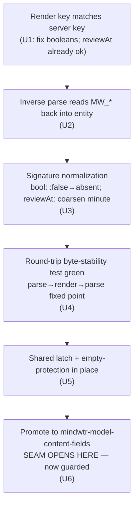

# feat: Read-write for reserved boolean/review drawer fields + set-area command

## Summary

Issue #16 asks for full bidirectional sync of six reserved drawer keys that v1 treats as
render-only. Research surfaced that **four of the six don't actually render today** (render-key
↔ server-key mismatch) and that two of them — `MW_RECURRENCE` and `MW_ATTACH` — carry lossy,
structured values that cannot round-trip byte-stably without their own design pass. Per the
scoping decision, this plan delivers the **four tractable fields** read-write and **defers
recurrence + attachments** to a follow-up.

In scope:

- `MW_FOCUS_TODAY` → `:isFocusedToday` (task, boolean)
- `MW_SEQUENTIAL` → `:isSequential` (project, boolean)
- `MW_FOCUSED` → `:isFocused` (project, boolean)
- `MW_REVIEW_AT` → `:reviewAt` (task + project, ISO datetime)
- A shared migration latch generalizing the existing single-field `notes-migrated` flag
- A new interactive `mindwtr-set-area` command (independent of the sync seam — `:areaId`
  already round-trips)

Each field follows the codebase's **allow-list-LAST** discipline: parse + render + byte-stable
round-trip test green *first*, promote to `mindwtr-model-content-fields` *last*, with the deploy
seam guarded by the migration latch.

---

## Problem Frame

The reserved drawer keys are displayed from server data but editing them in org never pushes
back. Worse, three of the four in-scope keys never render at all: `mindwtr-render--drawer-order`
and `mindwtr-render--prop-names` (`mindwtr-render.el:14-25`) use render keys `:focusToday`,
`:sequential`, `:focused` that do not match the server/model keys `:isFocusedToday`,
`:isSequential`, `:isFocused` (`mindwtr-model.el:201,207-208`). `(plist-get entity :focusToday)`
is always nil, so the generic drawer loop (`mindwtr-render.el:157-164`) emits nothing.
`MW_REVIEW_AT` is the exception — its render key `:reviewAt` matches, so it renders read-only
today but is never parsed back.

On the parse side, all six keys are already in `mindwtr-parse--known-props` (`mindwtr-parse.el:15-20`),
so they are not phantom-churning through `:mw-extra-props` — but the parser never reads them
into entity fields. The drawer-property inverse-parse alist (`mindwtr-parse.el:258-262`) covers
only `MW_ENERGY`/`MW_TIME_ESTIMATE`/`MW_ASSIGNED_TO`/`MW_LOCATION`/`MW_TASK_MODE`.

Promoting a field to the content signature is the operation governed by the documented
`allow-list-LAST` discipline (`docs/solutions/design-patterns/content-signature-allow-list-not-deny-list.md`)
and the deploy-seam guard (`docs/solutions/design-patterns/migration-latch-for-newly-signed-fields.md`).
**Only the three boolean fields open a deploy seam.** They never render today (key mismatch), so on
the first post-upgrade sync an old on-disk buffer parses them as empty, and last-write-wins would
PUT that empty value over data authored on mobile — exactly what the latch must guard.
`MW_REVIEW_AT` is different: it **already renders** today, so an old buffer carries its value and
parse recovers it; an empty local `:reviewAt` is therefore a genuine clear, not a false-empty, and
it needs **no** latch protection (it is still newly *signed* in U6, just not protected). The
`:supportNotes`/`:description` notes migration
is the direct prior art for the fix.

Separately, there is no command to set an entity's area — the only way today is to hand-edit the
`:MW_AREA:` drawer value. `:areaId` already round-trips and is allow-listed
(`mindwtr-model.el:153`), so the command is pure ergonomics with no signature/seam implications.

---

## Requirements

| ID | Requirement | Source |
|----|-------------|--------|
| R1 | `MW_FOCUS_TODAY`, `MW_SEQUENTIAL`, `MW_FOCUSED` render from their correct server keys and round-trip org→server | issue #14 |
| R2 | `MW_REVIEW_AT` parses back from org and round-trips org→server | issue #14 |
| R3 | Each promoted field is added to the signature allow-list **only after** a byte-stability round-trip test passes (allow-list-LAST) | `content-signature-allow-list-not-deny-list.md` |
| R4 | Boolean fields normalize so `:false`, nil, and absent sign identically (no phantom drift) | `content-signature-allow-list-not-deny-list.md` |
| R5 | `:reviewAt` is coarsened to minute precision for signing and dropped (not sent as `null`/`[]`) when nil | `json-encoding-gotchas-emacs-server-boundary.md` |
| R6 | A first post-upgrade sync must not clobber server-authored values of the **three boolean fields** (which never rendered) with empty local values; protection lifts only after a confirmed durable save. `:reviewAt` is excluded — it always rendered, so an empty local value is a genuine clear | `migration-latch-for-newly-signed-fields.md` |
| R7 | A new interactive command sets the area of a task or project at point, choosing from existing area names | issue #14 (added ask) |
| R8 | Recurrence and attachments are explicitly out of scope and remain in their current state (recurrence render-only, attach unchanged) | scoping decision |
| R9 | `make test` and `make compile` pass; at least one round-trip test exercises a realistic value per field | `AGENTS.md` |

---

## Key Technical Decisions

**KTD-1 — Fix the render-key mismatch in place, keep the `MW_*` property names.**
Change the render keys in `mindwtr-render--drawer-order` and `mindwtr-render--prop-names` from
`:focusToday`/`:sequential`/`:focused` to `:isFocusedToday`/`:isSequential`/`:isFocused`; the
user-facing drawer property strings (`MW_FOCUS_TODAY`, etc.) are unchanged. This is the minimal
correct fix and keeps the drawer vocabulary stable. `:reviewAt` and `:recurrence` keys already
match and are left alone. `:attach` is left as-is (deferred).

**KTD-2 — Booleans render `t` only for genuine `t`; `:false`/nil omit the property.**
The current generic loop renders any non-nil value, but the server's boolean false is the symbol
`:false` (non-nil, truthy in elisp), which would wrongly emit `:MW_FOCUS_TODAY: :false`. Boolean
fields get an explicit render branch: emit `:PROP: t` when the value is `t`, omit otherwise. This
makes "absent" the unique fixed point for "not set / false," which is what keeps the signature
honest (KTD-4).

**KTD-3 — Parse all four fields in a kind-agnostic site, with a blank-value guard.**
The existing scalar inverse-parse alist (`mindwtr-parse.el:258-262`) lives **inside the
`(when (eq kind 'task) …)` block** (opened at `:232`, closed at `:262`), so it only runs for tasks.
`:isSequential`/`:isFocused` are project-only and `:reviewAt` is task+project — adding them there
would leave the project-side fields permanently unparsed. Parse the four fields in a
**kind-agnostic post-loop block**, mirroring the `:areaId` resolution at `mindwtr-parse.el:274-275`
(which already runs for all kinds). `:reviewAt` parses as a raw ISO string (matching the current
render form). Booleans: `MW_FOCUS_TODAY: t` → `t`; a missing or blank drawer value → omit the key
(never read an empty string as a meaningful value — same `(and v (not (string-empty-p v)))`
discipline that fixed the blank-`MW_TYPE` bug in `silent-deletion-untyped-org-headings.md`).
Parsing a field on a kind that never carries it is harmless (the drawer simply lacks the key).

**KTD-4 — Signature normalization: boolean false-coercion + `:reviewAt` datetime coarsening.**
Add a boolean-field set to `mindwtr-signature.el` whose canonical form coerces `t`→`t` and
everything else (`:false`, nil) to the absent-equivalent, so a server `:false`, a parsed nil, and
an omitted key all sign identically. Add `:reviewAt` to `mindwtr-signature--datetime-fields` so
sub-minute precision (which org timestamps and the raw ISO can disagree on) does not churn.
**Mechanism correction (verified against code):** the empty-drop in `--canonical-plist`
(`mindwtr-signature.el:61`) tests the *raw* `plist-get` value, and `:false` is a non-nil symbol —
so line 61 does **not** drop it; folding `:false`→nil there would push a *present* `(key . nil)`
pair that signs differently from an absent key. The collapse must be guaranteed end-to-end:
canonicalize *before* the empty-drop test (compute the canonical value, then apply the nil/empty
drop to it), backed by the JSON nil-scalar drop in `mindwtr-util` that already strips nil scalars
from the encoded form. U3 proves the collapse through the **full `mindwtr-signature`** hash, not
`--canonical-plist` alone.

**KTD-5 — One shared migration latch for the three boolean fields.**
Generalize the `notes-migrated` flag into a single `fields-migrated`-style latch covering the
**three booleans** (`:isFocusedToday`, `:isSequential`, `:isFocused`) — the fields that never
rendered and so carry a false-empty seam. `:reviewAt` is **not** in the protected set (KTD-4/R6:
it always rendered, so an empty local value is a genuine clear, and protecting it would suppress a
legitimate first-cycle deletion). Mirror the existing flag-file mechanics in
`mindwtr-shadow.el:48-60` exactly: a one-way atomic-written flag file, `*-p` reader and `set-*`
writer. Generalize `mindwtr-sync--merge-content`'s single `protected-field` argument to a **set**
(`(eq k protected-field)` → `(memq k protected-set)`), resolved per kind in
`mindwtr-sync-build-candidate` (`:193-195`). **Call-site evolution:** keep the existing
`protect-empty-notes` boolean and its `notes-migrated` latch wiring unchanged; add a *parallel*
`protect-empty-fields` boolean from the new `fields-migrated` latch, and pass the **union** of the
notes field and the kind's protected booleans as the protected-set to `merge-content`. Latch only
after a confirmed save (`(unless save-failed ...)`, `mindwtr-sync.el:529-533`), never on the no-op
branch — identical to the notes latch reasoning. (Whether to ultimately fold the two latches into
one is the Open Question; the parallel-boolean shape above is the safe default and does not require
that decision now.)

**KTD-6 — `mindwtr-set-area` writes the `MW_AREA:` property, guarded against container over-stamp.**
Model on `mindwtr-set-status` (`mindwtr-commands.el:31-44`): kind-guard to `task`/`project`,
`completing-read` over names from `mindwtr-parse--build-area-names` with `require-match`, write via
`org-set-property "MW_AREA"`. Setting an area by **name** (not id) matches the buffer's
representation (`mindwtr-render.el:153-156`) and lets the existing parse path resolve it
(`mindwtr-parse--area-id`, `mindwtr-parse.el:192-195`). Creating a new area is out of scope.
**Container over-stamp guard (verified hazard):** `mindwtr-parse-heading` stamps `:areaId` from
`MW_AREA` **unconditionally for every kind** (`mindwtr-parse.el:274-275`), while a task's
`:projectId`/`:sectionId` come from outline nesting. Setting `MW_AREA` on a task that already sits
under a project would make it parse with **both** `:areaId` and `:projectId` — the dual-container
over-stamp that `parser-single-most-specific-container-id.md` documents as silently re-parenting on
the next PUT (both IDs are on the allow-list and get signed). So the command must **refuse (or warn
and skip)** when the entity at point is a task with a project/section ancestor — reuse the existing
`mindwtr-commands--in-project-p` helper (`mindwtr-commands.el:51-54`). Setting an area on a
standalone task or on a project is the valid case.

**KTD-7 — Recurrence and attachments stay exactly as they are.**
No code changes to `:recurrence` (renders read-only via `mindwtr-render--recurrence`) or `:attach`
(currently non-rendering). They remain off the allow-list and out of the latch's protected set. A
follow-up plan owns their reversible-form design.

---

## High-Level Technical Design

### Per-field promotion pipeline (allow-list-LAST)

Every in-scope field walks the same gated pipeline. The allow-list promotion (and therefore the
deploy seam) is the **last** gate, and it does not open until the latch protection exists.

### Per-field shape & normalization matrix

| Field (drawer) | Server key | Kind(s) | Shape | Render | Parse | Signature norm | Latch-protected |
|---|---|---|---|---|---|---|---|
| `MW_FOCUS_TODAY` | `:isFocusedToday` | task | boolean | `t` only (KTD-2) | `t`/omit (KTD-3) | `:false`→absent (KTD-4) | yes |
| `MW_SEQUENTIAL` | `:isSequential` | project | boolean | `t` only | `t`/omit | `:false`→absent | yes |
| `MW_FOCUSED` | `:isFocused` | project | boolean | `t` only | `t`/omit | `:false`→absent | yes |
| `MW_REVIEW_AT` | `:reviewAt` | task, project | ISO datetime | raw ISO (current) | raw ISO string | coarsen minute; drop-when-nil | **no** (always rendered — no false-empty seam) |
| `MW_RECURRENCE` | `:recurrence` | task | plist (lossy) | read-only (unchanged) | — | — | no (deferred) |
| `MW_ATTACH` | `:attachments` | task, project | array (lossy) | none (unchanged) | — | — | no (deferred) |

*The diagram and matrix are directional design guidance, not implementation specification — the
per-unit files and approach notes are authoritative.*

---

## Implementation Units

### U1. Correct boolean render-key mapping and boolean render semantics

**Goal:** Make `MW_FOCUS_TODAY`/`MW_SEQUENTIAL`/`MW_FOCUSED` actually render from their real server
keys, emitting the property only for a genuine `t`.

**Requirements:** R1, R8

**Dependencies:** none

**Files:**
- `mindwtr-render.el` (`mindwtr-render--drawer-order` `:14-17`, `mindwtr-render--prop-names`
  `:19-25`, drawer loop `:157-164`)
- `test/mindwtr-render-test.el`

**Approach:** In `mindwtr-render--drawer-order` and `mindwtr-render--prop-names`, replace render
keys `:focusToday`→`:isFocusedToday`, `:sequential`→`:isSequential`, `:focused`→`:isFocused`
(KTD-1). Leave `:reviewAt`, `:recurrence`, `:attach` untouched. In the drawer loop, add a
boolean branch so the three boolean fields emit `:PROP: t` only when the value is `eq` to `t` and
emit nothing for `:false`/nil (KTD-2). Keep the existing `(eq v t) "t"` behaviour but ensure
`:false` does not fall through to the `(t v)` arm.

**Patterns to follow:** existing drawer loop and the `(eq v t) "t"` idiom (`mindwtr-render.el:162`).

**Test scenarios:**
- A task with `:isFocusedToday t` renders a `:MW_FOCUS_TODAY: t` drawer line.
- A task with `:isFocusedToday :false` renders **no** `MW_FOCUS_TODAY` line.
- A task with no `:isFocusedToday` key renders no `MW_FOCUS_TODAY` line.
- A project with `:isSequential t` and `:isFocused :false` renders `MW_SEQUENTIAL` but not
  `MW_FOCUSED`.
- Existing render output for energy/time/location is byte-identical (no regression from the loop
  change).

**Verification:** Render tests pass; a project/task with these booleans set to `t` shows the
expected drawer lines and nothing for false/absent.

---

### U2. Inverse parse for the four fields

**Goal:** Read `MW_FOCUS_TODAY`/`MW_SEQUENTIAL`/`MW_FOCUSED`/`MW_REVIEW_AT` back into entity fields.

**Requirements:** R1, R2

**Dependencies:** none (pairs with U1)

**Files:**
- `mindwtr-parse.el` — add a **kind-agnostic** post-loop parse block near the `:areaId` resolution
  at `:274-275`; do **not** extend the task-only alist at `:258-262` (entity assembly `:240-276`)
- `test/mindwtr-parse-test.el`

**Approach:** Parse the four fields in a kind-agnostic block that runs for every kind — mirror the
`:areaId` resolution at `mindwtr-parse.el:274-275`, which sits *outside* the `(when (eq kind 'task))`
guard. **Do not add them to the alist at `:258-262`**: that loop is inside the task-only block
(closed at `:262`), so project `:isSequential`/`:isFocused` and project `:reviewAt` would never
parse (R1/R2 would silently fail for projects while task tests pass green). `MW_REVIEW_AT` →
`:reviewAt` (raw string). Booleans: set the key to `t` only when the trimmed value equals `"t"`; a
blank or absent value omits the key (KTD-3 blank-guard). These props are already in
`mindwtr-parse--known-props` (`:15-20`), so no change there. Parsing a field on a kind that never
carries it is harmless (the drawer simply lacks the key).

**Patterns to follow:** the kind-agnostic `:areaId` resolution (`mindwtr-parse.el:274-275`); the
`(and v (not (string-empty-p v)) v)` blank-guard discipline from
`silent-deletion-untyped-org-headings.md`.

**Test scenarios:**
- `:MW_FOCUS_TODAY: t` parses to `:isFocusedToday t`.
- A blank `:MW_FOCUS_TODAY:` (empty value) parses to **no** `:isFocusedToday` key (not `t`, not `""`).
- Absent `MW_FOCUS_TODAY` yields no `:isFocusedToday` key.
- `:MW_REVIEW_AT: 2026-06-09T14:30:00.000Z` parses to `:reviewAt` with that string.
- **A project heading** with `MW_SEQUENTIAL: t`, `MW_FOCUSED: t`, and `MW_REVIEW_AT: <iso>` parses
  all three (guards against the task-only-block regression).
- A task heading carrying none of these parses without any of the four keys.

**Verification:** Parse tests pass; parsing a rendered drawer recovers the booleans and reviewAt.

---

### U3. Signature normalization for booleans and review datetime

**Goal:** Ensure `:false`/nil/absent booleans sign identically, and `:reviewAt` coarsens to minute
precision and drops when nil.

**Requirements:** R4, R5

**Dependencies:** U2

**Files:**
- `mindwtr-signature.el` (`mindwtr-signature--datetime-fields` `:13`,
  `mindwtr-signature-canonical-value` `:30-44`)
- `mindwtr-util.el` / `mindwtr-util-json-array-fields` (`:68`) — verify `:reviewAt` (nullable
  scalar) is dropped when nil, not serialized as `null`/`[]`
- `test/mindwtr-signature-test.el`

**Approach:** Add `:reviewAt` to `mindwtr-signature--datetime-fields` so it routes through
`mindwtr-util-iso-coarsen-minute` (KTD-4/R5). Add a boolean-field set and a `cond` arm in
`mindwtr-signature-canonical-value` that maps a boolean field's value to `t` when `eq t` and to nil
otherwise. **Critical (KTD-4 mechanism):** the empty-drop in `--canonical-plist` (`:61`) tests the
*raw* `plist-get` value — `:false` is a non-nil symbol and is **not** dropped there, so folding
`:false`→nil inside `canonical-value` alone would still push a present `(key . nil)` pair that signs
differently from an absent key. Make the drop operate on the *canonicalized* value: compute the
canonical value first, then apply the nil/empty-drop test to it (so a folded-`:false` boolean drops
out like a true absent key). Confirm the JSON encoder also drops a nil `:reviewAt` rather than
emitting `null` (server 422s on a null ISO field, per
`json-encoding-gotchas-emacs-server-boundary.md`); `:reviewAt` is a scalar, so it must **not** be
added to `mindwtr-util-json-array-fields`.

**Patterns to follow:** `mindwtr-signature--norm-checklist`'s `:false` coercion
(`mindwtr-signature.el:27`); datetime coarsening for `:startTime`/`:dueDate`/`:completedAt`.

**Test scenarios:**
- An entity with `:isFocusedToday :false` and one with the key absent produce the **same**
  `mindwtr-signature` hash (assert through the full signature, not `--canonical-plist` alone).
- An entity with `:isFocusedToday t` produces a **different** signature from `:false`/absent.
- `:reviewAt` values differing only in sub-minute seconds produce the same signature.
- A nil `:reviewAt` is dropped (signs as absent).
- (Encoding) a candidate with nil `:reviewAt` does not serialize a `null` reviewAt key on the wire.

**Verification:** Signature tests pass; `:false`/nil/absent booleans collapse; sub-minute reviewAt
deltas do not drift.

---

### U4. Round-trip byte-stability tests (pre-promotion)

**Goal:** Prove parse→render→parse is a fixed point for all four fields **before** they are signed.

**Requirements:** R3, R9

**Dependencies:** U1, U2, U3

**Files:**
- `test/mindwtr-roundtrip-test.el` (mirror `mindwtr-roundtrip-render-is-stable` `:61`,
  empty/nil-equivalence tests `:260,:270`)

**Approach:** Add round-trip tests asserting `render(parse(render x)) == render(x)` byte-identical
for a task with `:isFocusedToday t` + `:reviewAt`, and a project with `:isSequential t` +
`:isFocused t` + `:reviewAt`. Add absent-vs-false equivalence tests (a boolean `:false` and an
absent key render to the same bytes and parse to the same entity shape). These tests must pass
**while the fields are still off the allow-list** — they assert representational stability, not
signature stability (signature stability is exercised in U6 after promotion).

**Patterns to follow:** existing roundtrip tests `:48,:61,:141,:260,:270`.

**Test scenarios:**
- Render→parse→render of a focused task is byte-identical.
- Render→parse→render of a sequential+focused project is byte-identical.
- A `:reviewAt` value survives render→parse→render unchanged at minute precision.
- A `:false` boolean and an absent boolean render to identical bytes.

**Verification:** `make test` green; the fixed-point oracle passes for every in-scope field.

---

### U5. Generalize the migration latch to a shared field-set guard

**Goal:** Replace the single-field notes latch/protection plumbing with a shared latch and a
**set** of protected fields, so the boolean seam is guarded the moment the fields are promoted.

**Requirements:** R6

**Dependencies:** none (infrastructure; sequence before U6)

**Files:**
- `mindwtr-shadow.el` (`mindwtr-shadow-notes-migrated-p` / `-set-notes-migrated` `:48-60` — add a
  parallel shared latch, e.g. `mindwtr-shadow-fields-migrated-p` / `-set-fields-migrated`)
- `mindwtr-sync.el` (`mindwtr-sync--merge-content` `protected-field` → protected-field **set**
  `:88-119`; `mindwtr-sync-build-candidate` `:176-195`; latch-after-save `:470-472,:518-533`)
- `mindwtr-model.el` — a per-kind map of which newly-signed **booleans** are protectable
  (task: `:isFocusedToday`; project: `:isSequential`, `:isFocused`). `:reviewAt` is **not**
  protected (it always rendered — see KTD-4/R6)
- `test/mindwtr-sync-test.el`, `test/mindwtr-shadow-test.el`

**Approach:** Add a one-way `fields-migrated` flag mirroring the notes flag's atomic-write
mechanics exactly. Generalize `merge-content`'s `protected-field` parameter to accept a list/set
(`(eq k protected-field)` → `(memq k protected-set)`); while the shared latch is unset, an **empty**
local value for any field in the set keeps the shadow value (a real edit is still adopted —
protection suppresses only an empty/cleared value). Resolve the per-kind protected set in
`build-candidate` (kind is unavailable in `merge-content` because `:mw-kind` is stripped — same
constraint as today). **Call-site evolution (keep both latches separate — the safe default):** leave
the existing `protect-empty-notes` boolean and `notes-migrated` wiring unchanged; add a *parallel*
`protect-empty-fields` boolean computed from `(not (mindwtr-shadow-fields-migrated-p))`, and pass
the **union** of the kind's notes field and its protected booleans as the protected-set to
`merge-content`. Set the new latch only inside the confirmed-save branch, never on the no-op branch
(KTD-5). Whether to ultimately fold the two latches into one is the Open Question — the
parallel-boolean shape does not require resolving it now. **Fold caveat (if chosen later):** a
client that already has `notes-migrated` set must seed `fields-migrated` from it, or the fold would
re-open notes protection on an already-migrated client.

**Patterns to follow:** the entire notes-migration implementation is the template —
`mindwtr-shadow.el:48-60`, `mindwtr-sync.el:88-119,470-472,518-533`, and
`migration-latch-for-newly-signed-fields.md`.

**Execution note:** Add the two regression tests the `:supportNotes` work used as characterization
of the contract: a save-failure does **not** latch; a clean cycle **does**.

**Test scenarios:**
- Pre-migration (latch unset): a buffer that parses `:isFocusedToday` empty, against a shadow with
  `:isFocusedToday t`, keeps the shadow `t` (no clobber).
- Pre-migration: a genuine local edit (`:isFocusedToday t` where shadow had it absent) is still
  adopted — protection suppresses only empties.
- Pre-migration: a project's `:isSequential`/`:isFocused` are protected the same way.
- **`:reviewAt` is NOT protected:** even pre-migration, an empty local `:reviewAt` against a
  non-empty shadow `:reviewAt` **clears** normally (it is a genuine deletion, not a false-empty).
- Post-migration (latch set): an empty `:isFocusedToday` against a non-empty shadow **clears**
  normally.
- A confirmed clean cycle sets the latch; a sync whose save failed leaves the latch unset.
- The no-op (HEAD-match) branch does not set the latch.
- The existing notes protection still holds (no regression from threading the protected-set union).

**Verification:** Sync/shadow tests pass; the three booleans are protected pre-migration and clear
normally post-migration; `:reviewAt` always clears normally; latch flips only after a durable save.

---

### U6. Promote the four fields to the allow-list (cross the seam)

**Goal:** Add the four fields to `mindwtr-model-content-fields` so they participate in change
detection — the seam-crossing step, now guarded by U5.

**Requirements:** R3, R4, R5

**Dependencies:** U4, U5

**Files:**
- `mindwtr-model.el` (`mindwtr-model-content-fields` `:150-169`; update the docstring's
  "excluded by construction" example list to drop the now-included fields)
- `test/mindwtr-roundtrip-test.el` (add signature-stability assertions now that the fields sign)
- `test/mindwtr-signature-test.el`

**Approach:** Add `:isFocusedToday :isSequential :isFocused :reviewAt` to
`mindwtr-model-content-fields`. Update the docstring (`:157`) so the named-exclusions example no
longer lists these — and scan the **rest** of the docstring (`:155-169`) for any second mention of
the exclusion narrative, so the doc does not end up describing a now-promoted field as
"excluded by construction." (Seam note: U1–U4 are seam-inert — until this unit lands, the four
fields are absent from `mindwtr-model-content-fields`, so neither `merge-content` nor the signature
observes them, and the shadow value is echoed verbatim. The only release constraint is the U5/U6
pairing.) Add render→parse→**signature**-stable tests (mirror
`mindwtr-roundtrip-render-parse-signature-stable` `:48`) that now exercise the promoted fields — a
focused task and a sequential project survive a render/parse cycle with an unchanged signature
(no phantom `:rev` bump). This unit must land in the same release as U5 (no release between
promotion and protection).

**Patterns to follow:** the allow-list-LAST sequence in
`content-signature-allow-list-not-deny-list.md`; signature-stable roundtrip test `:48`.

**Test scenarios:**
- A focused task render→parse cycle yields an identical signature (no drift).
- A sequential+focused project render→parse cycle yields an identical signature.
- Editing `:isFocusedToday` from `:false`→`t` classifies as `update` (signature changes).
- A full-appdata round-trip across all kinds (extends `:141`) stays signature-stable with the new
  fields populated.

**Verification:** `make test` + `make compile` green; promoted fields drive change detection
without phantom drift; the docstring no longer claims them excluded.

---

### U7. `mindwtr-set-area` interactive command

**Goal:** Add a command that sets the area of the task or project at point from existing areas.

**Requirements:** R7

**Dependencies:** none

**Files:**
- `mindwtr-commands.el` (new command + helper; mirror `mindwtr-set-status` `:31-44`)
- `mindwtr.el` (autoload / `mindwtr-mode-map` keybinding — follow how `mindwtr-set-status` is wired)
- `test/mindwtr-commands-test.el`

**Approach:** Add `mindwtr-set-area` (KTD-6): kind-guard to `task`/`project` via
`mindwtr-commands--kind-at-point`; build the candidate list from
`mindwtr-parse--build-area-names`; `completing-read` with `require-match` so only an existing area
name is accepted (a name with no id resolves to nil and silently drops the area); write with
`org-set-property "MW_AREA" name` inside `save-excursion` + `org-back-to-heading t`. Off a
non-task/project heading, do nothing (or message), matching the `mindwtr-set-status` guard. No
signature/seam work — `:areaId` already round-trips. **Container over-stamp guard (KTD-6, verified
hazard):** `mindwtr-parse-heading` stamps `:areaId` from `MW_AREA` unconditionally for every kind
(`mindwtr-parse.el:274-275`) while a task's `:projectId` comes from outline nesting — so setting
`MW_AREA` on a task that already sits under a project would parse it with **both** IDs, the
dual-container over-stamp `parser-single-most-specific-container-id.md` forbids (it silently
re-parents on the next PUT). **Refuse (or warn and skip)** when the entity is a task with a
project/section ancestor — reuse `mindwtr-commands--in-project-p` (`mindwtr-commands.el:51-54`).
Setting an area on a standalone task or on a project is the valid case.

**Patterns to follow:** `mindwtr-set-status` (`mindwtr-commands.el:31-44`),
`mindwtr-commands--kind-at-point` (`:15-20`), `mindwtr-commands--in-project-p` (`:51-54`),
`mindwtr-parse--build-area-names` (`mindwtr-parse.el:178-190`).

**Test scenarios:**
- On a standalone task heading, choosing an existing area writes `:MW_AREA: <name>`, and a
  subsequent parse resolves `:areaId` to that area's id.
- On a project heading, the command sets the area likewise.
- **On a task that sits under a project/section, the command refuses** (or warns and skips) and
  writes no `MW_AREA` — and a parse of that task yields `:projectId` with **no** `:areaId` (guards
  the dual-container over-stamp).
- On a non-task/project heading (e.g. an area or container), the command no-ops (or messages) and
  writes nothing.
- Completion offers exactly the existing area names; a non-matching entry is rejected
  (`require-match`).
- Changing an already-set area replaces the `MW_AREA` value (no duplicate property).

**Verification:** Commands tests pass; invoking the command on a task/project sets a resolvable
area that survives a sync round-trip.

---

## Scope Boundaries

In scope: read-write for the three booleans + `MW_REVIEW_AT`, the shared migration latch, and the
`mindwtr-set-area` command.

### Deferred to Follow-Up Work
- **`MW_RECURRENCE` read-write** — the flattened `rrule` string is lossy versus the full server
  plist (`:rule`/`:strategy`/`:byDay`/…); needs a reversible-form design pass before it can
  round-trip byte-stably. Stays render-only.
- **`MW_ATTACH` read-write** — structured attachment array; needs lossy-normalization design
  (drop server-assigned ids like checklist) and link-conversion discipline
  (`org-markdown-link-conversion-roundtrip.md`). Unchanged (currently non-rendering).
- **Creating a new area** from `mindwtr-set-area` — command only selects among existing areas.
- A consolidated `/ce-compound` learning capturing **multi-field** promotion (the existing latch
  doc covers single-field only).

---

## Open Questions

- **Shared latch vs. fold-in:** Should the new `fields-migrated` latch be a separate flag, or
  should the notes migration fold into one shared latch? Default: separate new flag (parallel
  `protect-empty-notes` / `protect-empty-fields` booleans), to leave the established notes
  semantics untouched. If folded later, a client with `notes-migrated` already set must seed
  `fields-migrated` from it (see KTD-5 fold caveat). Resolve during U5 — a planning-time lean, not
  a blocker.
- **`MW_REVIEW_AT` render form:** keep the raw ISO string (current, simplest, already round-trips)
  vs. an org inactive timestamp. Default: raw ISO. Revisit only if a round-trip test in U4 reveals
  instability.

---

## Risks & Dependencies

| Risk | Impact | Mitigation |
|------|--------|------------|
| Promote a field before round-trip is byte-stable | False drift across many entities, phantom `:rev` bumps, corrupted server history (the documented 30/32 incident) | Allow-list-LAST enforced by unit ordering: U6 (promote) depends on U4 (round-trip green) + U5 (latch) |
| Boolean `:false` signs differently from absent | Phantom churn; local side wins every LWW merge | KTD-4 boolean normalization + U3 explicit `:false`==absent==nil test |
| First post-upgrade sync clobbers mobile-authored **boolean** values (never rendered before) | Silent cross-version data loss, invisible to single-version tests | U5 shared latch protects the three booleans; latch only after confirmed save |
| Over-protecting `:reviewAt` suppresses a genuine first-cycle deletion | A user's legitimate reviewAt clear is silently reverted once | `:reviewAt` excluded from the protected set — it always rendered, so empty == genuine clear (KTD-4/R6) |
| `:reviewAt` serialized as `null` when empty | Server 422 ("must be a valid ISO timestamp when present") | U3 drop-when-nil; do not add to JSON array-fields |
| Latch flips before durable save | Reload from stale file re-exposes the clobber | Set latch inside `(unless save-failed ...)` only; never on no-op branch (KTD-5) |
| `mindwtr-set-area` writes an unresolvable name | Area silently dropped on parse | `completing-read` with `require-match` over real area names (KTD-6) |
| `mindwtr-set-area` over-stamps `:areaId` on a task already under a project | Dual-container parse → server silently re-parents the task on next PUT | Refuse/warn when the task has a project/section ancestor (`mindwtr-commands--in-project-p`, KTD-6) |

**Cross-cutting dependency:** U6 and U5 must ship in the same release — promotion opens the seam,
the latch guards it; no release may sit between them.

---

## System-Wide Impact

- **Change detection** gains four signed fields across task and project entities; every sync now
  diffs them. Normalization (U3) is what keeps that from churning.
- **Shadow on disk** gains a new latch flag file (`fields-migrated`). First sync after upgrade
  performs the one-time protected migration, then latches.
- **Org buffers** gain three previously-absent boolean drawer lines on entities that carry them;
  `MW_REVIEW_AT` becomes editable rather than read-only.
- **Affected parties:** org-side users (new editable fields), mobile users (protected from
  cross-version clobber), the smoke suite (exercise at least one non-ASCII title and a populated
  reviewAt per `AGENTS.md`).

---

## Sources & Research

- `docs/solutions/design-patterns/content-signature-allow-list-not-deny-list.md` — allow-list-LAST,
  the 30/32 false-drift incident, normalization families.
- `docs/solutions/design-patterns/migration-latch-for-newly-signed-fields.md` — deploy-seam guard,
  confirmed-save-before-latch, `:supportNotes` prior art.
- `docs/solutions/logic-errors/silent-deletion-untyped-org-headings.md` — blank-value-read-as-truthy
  discipline; explicitly names `MW_FOCUS_TODAY` (issue #2) as a deliberately-excluded field this
  plan now fixes.
- `docs/solutions/integration-issues/json-encoding-gotchas-emacs-server-boundary.md` — nil scalar
  must be dropped, not `null`/`[]`; array-field registration.
- `docs/solutions/logic-errors/parser-single-most-specific-container-id.md` — `:areaId` semantics
  for the set-area command.
- `docs/solutions/design-patterns/save-as-sync-commit-point.md` — post-PUT commit region for the
  latch.
- `CONCEPTS.md` — Allow-list, Content signature, Round-trip byte-stability, Migration latch, Shadow.
- Code anchors: `mindwtr-render.el:14-25,153-164`; `mindwtr-parse.el:15-20,178-195,258-276`;
  `mindwtr-model.el:150-169,196-215`; `mindwtr-signature.el:10-44,46-69`;
  `mindwtr-sync.el:88-119,176-219,455-533`; `mindwtr-shadow.el:48-60`;
  `mindwtr-commands.el:15-44`.
