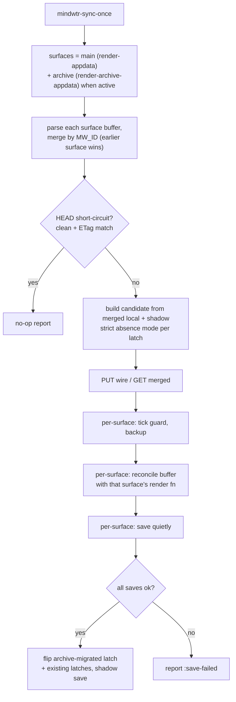
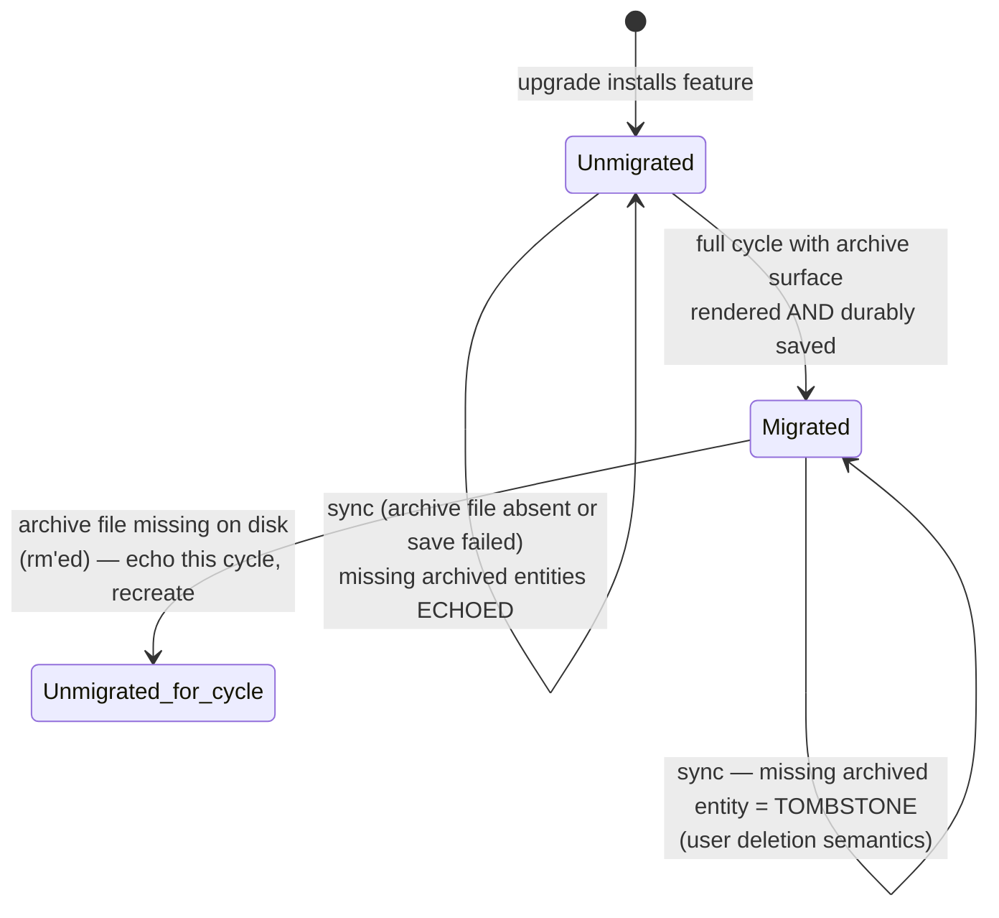

# feat: Sync archived work through a second archive-file surface

## Summary

Give archived entities a synced home: a second org file (`mindwtr_archive.org`)
that the sync engine parses as local state and reconcile rebuilds canonically
each cycle. "Archived" becomes a status whose render surface is a different
file — cloud-side archives (including the full historical backlog) appear there,
trash/ARCH refiles there immediately, and edits there (un-archiving, deletion,
content changes) sync back to the cloud. A migration latch guards the deploy
seam so the first sync after upgrade can never read the not-yet-created archive
file as a mass deletion.

---

## Problem Frame

Archived entities are not rendered into the org file at all: the sync after
something becomes `archived` — locally via `ARCH`/clarify-trash, or remotely via
another client or the server's auto-archive — rebuilds the buffer without it.
The only record lives on the server; locally the heading just vanishes, along
with any LOGBOOK/CLOCK content. Issue #37 asks for archived work to be stored in
org archive locations; the follow-on requirement is that the archive is *synced*
— archived items from every device land in it, and it remains editable rather
than being a write-once log.

A naive "append on drop" design needs dedup tracking and a pending-push ledger
(a heading that leaves the buffer before the server learns it is archived would
be tombstoned — deleted server-side — by `mindwtr-sync-build-candidate`'s
absence rule). Treating the archive file as a second render surface dissolves
all of that machinery: a refiled entity is still *present* in local state, so
nothing special is needed.

---

## Requirements

**Archive surface**

- R1. Every non-deleted archived entity syncs into the local archive file —
  including items archived only on the cloud; the first sync with the surface
  active backfills the full historical archived set.
- R2. The archive file is bidirectionally synced: changing an entry's keyword
  (e.g. `ARCH` → `NEXT`) un-archives it and moves it back to the tasks file on
  the next sync; deleting a heading deletes the entity on the server; content
  edits push like main-file edits.
- R3. An archived project renders as a full subtree (its sections and tasks,
  whatever their statuses); an archived task whose project or section still
  lives in the main file keeps its containment across the file split.
- R4. The archive render round-trips byte-stably (render → parse → render is a
  fixed point), the repo's headline invariant, applied to the new surface.

**Immediate archiving**

- R5. Clarify's trash outcome and `mindwtr-set-status` choosing `ARCH` refile
  the heading into the archive file immediately, not at the next sync.
- R6. A new `mindwtr-archive-item-at-point` command archives the task or
  project at point: sets `ARCH` and refiles immediately.
- R7. Immediate refile is UX only: when it fails, or the surface is inactive,
  the heading keeps its `ARCH` keyword in place and the next sync performs the
  identical move. Correctness never depends on the commands.

**Safety and compatibility**

- R8. The first sync after upgrade must not delete archived items on the
  server: until the archive surface has been durably rendered once, an archived
  entity missing from local state is echoed verbatim (today's behavior), never
  tombstoned. An archive file missing on disk always reads as "not yet
  rendered", never as "everything was deleted".
- R9. Legacy single-file behavior is preserved when the surface is inactive
  (main buffer visits no file and no path is configured) — existing temp-buffer
  flows and tests run unchanged.

**Editing ergonomics**

- R10. The archive file is a full citizen: saving it arms the debounced
  auto-sync, its unsaved edits stand down background rebuilds, a manual
  `mindwtr-sync` saves it first alongside the tasks file, and its buffer opens
  in `mindwtr-mode` (keyword registration, status keybindings).

---

## Key Technical Decisions

- KTD1. **The archive file is a second synced render surface, not a write-once
  log.** Reconcile rebuilds it canonically from merged data every full cycle,
  exactly like the main file. Every requirement then falls out of existing sync
  semantics: cloud archives appear on reconcile (R1), dedup is automatic (the
  file is regenerated, nothing can be filed twice), un-archive and delete are
  ordinary parse-side changes (R2), and the immediate-refile commands need no
  correctness machinery (R7). The rejected alternative — append-on-drop with a
  dedup ledger and a pending-push set to defeat the tombstone rule — was
  designed in full and discarded; see `supersedes` for the archaeology.

- KTD2. **Orchestration iterates a list of surfaces, not named buffers.** Each
  surface is a (buffer × render-function × backup-prefix) entry; parse-merge,
  tick guards, backups, reconcile, and saves all loop over the list, with
  earlier surfaces winning duplicate ids. This is issue #18's bucket→file
  routing *mechanism* with two fixed entries; #20 later adds the routing config
  and per-bucket renders with no orchestration rework.

- KTD3. **One flat canonical archive file — no datetree, no year files.**
  org-gtd's `gtd_archive_<year>::datetree/` (the prior approach in the user's
  org-gtd config) was an append log; a synced surface must be deterministically
  regenerable from data, which a datetree keyed on "date archived here" is not.
  Layout: one `* Archive` container, archived standalone tasks first, then
  archived projects as subtrees, ordered by the existing render sort. Year
  sharding by `:completedAt` is a deferred follow-up.

- KTD4. **Containment crosses the file split via explicit drawer props.**
  `:projectId`/`:sectionId` are signature content fields derived from outline
  ancestry (`mindwtr-parse.el`, task branch of `mindwtr-parse-buffer`). An
  archived task whose project is live cannot nest under it — the project
  renders in the other file — so the archive render emits `:MW_PROJECT_ID:` /
  `:MW_SECTION_ID:` properties and the parser honors them over ancestry. No new
  content fields are introduced, so there is no signature migration and no new
  latch for this part.

- KTD5. **A migration latch guards the deploy seam (the riskiest part of the
  plan).** With strict semantics on, an archived shadow entity absent from
  local state is a user deletion → tombstone. On the first post-upgrade sync
  the archive file does not exist, so without a guard every archived item would
  be mass-deleted server-side. Clone the existing notes/fields latch pattern
  (`mindwtr-shadow-notes-migrated-p`, flip discipline at the post-save point in
  `mindwtr-sync-once`): strict absence semantics activate only once the archive
  surface has been durably saved once, and an archive file missing on disk
  falls back to echo for that cycle regardless of the latch (an `rm` must not
  read as "delete everything").

- KTD6. **Strict absence semantics are a dynamic mode, not a rewrite.**
  `mindwtr-sync--rendered-absent-p` and `mindwtr-sync--live-container-ids`
  gain an archive-strict mode (let-bound by `mindwtr-sync-once`): archived
  projects count as live containers (they render in the archive file), and the
  archived/no-list escapes that today excuse absence stop applying. With the
  mode off, behavior is byte-identical to today (R9).

- KTD7. **Immediate refile moves the buffer subtree and stamps containment.**
  The command path cuts the subtree, re-roots it to level 2 under `* Archive`,
  writes `MW_PROJECT_ID`/`MW_SECTION_ID` from the ancestry it is about to lose,
  and saves both buffers. No ledger, no server interaction: the next sync
  parses the archive file and pushes `archived` as an ordinary update — and a
  never-synced capture that is trashed simply reaches the server as a create
  with archived status.

- KTD8. **Archive path resolution anchors on `mindwtr-file` first**, falling
  back to the current buffer's file. Hooks and timers run with arbitrary
  buffers current (including the archive buffer itself), so derivation must not
  depend on which buffer is current when `mindwtr-file` is configured.

- KTD9. **Untyped headings in the archive file quarantine; no kind inference
  for the `archive` container role.** A direct child of `* Archive` could be a
  task or a project, so inference would guess. Rendered content always carries
  `MW_TYPE`; hand-added untyped headings flow to the existing `* Sync Failures`
  quarantine with its standard fix-it note.

---

## High-Level Technical Design

One sync cycle over the surface list:



The latch lifecycle that protects archived data on the server:



Archive file canonical layout (directional, mirrors the main render's container
pattern):

```text
#+TODO: <canonical keyword line>
* Archive                      :MW_LIST: archive (container)
** ARCH <standalone archived task>
** ARCH <archived task of a live project>   ← carries :MW_PROJECT_ID:/:MW_SECTION_ID:
** ARCH <archived project>
*** <section>
**** DONE <task>               ← ancestry containment, no props needed
** ARCH <next archived project> ...
```

---

## Implementation Units

### U1. Archive surface plumbing

- **Goal:** A module that owns the archive file's location and buffer.
- **Requirements:** R9, R10 (buffer in `mindwtr-mode`); KTD8.
- **Dependencies:** none.
- **Files:** `mindwtr-archive.el` (new), `test/mindwtr-archive-test.el` (new).
- **Approach:** `mindwtr-archive-file` defcustom (nil = derive
  `mindwtr_archive.org` beside the anchor file; string = path; function =
  called for a path). `mindwtr-archive-path` resolves it, anchoring on
  `mindwtr-file` first, then the current buffer's file; returns nil when
  neither exists (surface inactive — the legacy-mode switch everything else
  keys on). `mindwtr-archive-buffer` visits the path (creating the empty file's
  buffer unless told not to) and enables `mindwtr-mode` when available, guarded
  with `fboundp` so the module never requires `mindwtr.el` (avoids a require
  cycle: `mindwtr.el` → `mindwtr-sync.el` → `mindwtr-archive.el`).
- **Patterns to follow:** defcustom shapes in `mindwtr.el`; `defvar` forward
  declaration for `mindwtr-file` as done across modules.
- **Test scenarios:**
  - Main buffer visits `/tmp/mw/tasks.org`, no custom, `mindwtr-file` nil →
    path is `/tmp/mw/mindwtr_archive.org`.
  - Custom string and custom function → returned verbatim/called.
  - Temp buffer, no custom, `mindwtr-file` nil → nil (inactive).
  - `mindwtr-file` set, called from an unrelated buffer → derives beside
    `mindwtr-file`, not beside the current buffer's file.
- **Verification:** `make test` green; `make compile` clean under
  `byte-compile-error-on-warn`.

### U2. Archive container role and explicit containment parsing

- **Goal:** The parser understands the archive file's layout.
- **Requirements:** R3, R4; KTD4, KTD9.
- **Dependencies:** none.
- **Files:** `mindwtr-model.el`, `mindwtr-parse.el`, `test/mindwtr-parse-test.el`
  (create if no parse test file exists — check first and append if one does).
- **Approach:** Add `"archive"` to `mindwtr-model-list-roles` and its title to
  the list-title table; do not extend `mindwtr-parse--infer-kind` (KTD9 — an
  unknown role already returns nil and quarantines). Add `MW_PROJECT_ID` /
  `MW_SECTION_ID` to `mindwtr-parse--known-props` (so they never leak into
  extra-props) and make the task branch of `mindwtr-parse-buffer` prefer the
  explicit props over `mindwtr-parse--ancestor-id`, section before project,
  matching the existing ancestry precedence.
- **Patterns to follow:** the existing task-branch containment cond in
  `mindwtr-parse-buffer`; known-props handling in `mindwtr-parse--extra-props`.
- **Test scenarios:**
  - Task under `* Archive` with `:MW_PROJECT_ID: p9` and no project ancestor →
    parses with `:projectId "p9"`, status `archived` from `ARCH`, and no
    extra-props leakage.
  - Same with `:MW_SECTION_ID:` → `:sectionId` set.
  - Task nested under a project heading inside the archive file, no explicit
    props → `:projectId` from ancestry, exactly like the main file.
  - Untyped heading directly under `* Archive` → parses to no entity
    (quarantine path, not a guessed kind).
- **Verification:** all pre-existing parse and round-trip tests pass unchanged
  (the main render never emits these props).

### U3. Archive renderer

- **Goal:** A canonical render of exactly the entities the main render drops
  for being archived.
- **Requirements:** R1, R3, R4; KTD3, KTD4.
- **Dependencies:** U2 (role title, containment parse for the round-trip test).
- **Files:** `mindwtr-render.el`, `test/mindwtr-render-test.el`.
- **Approach:** `mindwtr-render-archive-appdata`, the mirror of
  `mindwtr-render-appdata`: keyword line, `* Archive` container, then (a) flat
  archived tasks — status `archived`, not tombstoned, not inside an
  archived-and-alive project — at level 2 with containment props injected into
  the drawer when the task carries `:projectId`/`:sectionId`; then (b) archived
  projects as full subtrees via the existing `mindwtr-render--project-subtree`
  with non-dropping section/task lists (an archived project's `done`/`next`
  children belong inside it). Containment props are injected at a fixed point
  in the rendered drawer (immediately before `:END:`) so bytes round-trip
  stably. Ordering reuses `mindwtr-render--sorted` /
  `mindwtr-render--sorted-projects` for determinism.
- **Patterns to follow:** `mindwtr-render-appdata`'s bucket assembly;
  `mindwtr-render--live` filtering; the `\n:END:\n` splice idiom used by the
  org-only graft.
- **Test scenarios:**
  - Mixed appdata (flat archived task; archived task owned by a live project;
    done task inside an archived project; live task; tombstoned archived task)
    → layout has the container, the flat tasks with the owned one carrying
    `:MW_PROJECT_ID:`, the archived project subtree containing its done child;
    live and tombstoned entities absent.
  - Covers R4. Render → parse → render reproduces identical bytes.
  - Archived project's child appears exactly once (inside the subtree, not
    also flat).
- **Verification:** `make test` green including the byte-stability case;
  `make compile` clean.

### U4. Migration latch and strict absence semantics

- **Goal:** Absence of an archived entity means deletion — but only once the
  surface provably exists on disk.
- **Requirements:** R2 (deletion semantics), R8, R9; KTD5, KTD6.
- **Dependencies:** none (independent of U1–U3; meets them in U5).
- **Files:** `mindwtr-shadow.el`, `mindwtr-sync.el`, `test/mindwtr-sync-test.el`.
- **Approach:** Clone the notes-latch persistence pair as
  `mindwtr-shadow-archive-migrated-p` / `mindwtr-shadow-set-archive-migrated`.
  Add a dynamic `mindwtr-sync--archive-strict` (default nil; let-bound by
  `mindwtr-sync-once` in U5). Under strict mode:
  `mindwtr-sync--live-container-ids` counts archived projects as live, and
  `mindwtr-sync--rendered-absent-p` stops excusing archived status and the
  archived-maps-to-no-list case — absence then falls through to the existing
  tombstone branch of `mindwtr-sync-build-candidate`, untouched.
- **Execution note:** Write the deploy-seam tests first; this unit is the
  data-safety core of the plan.
- **Patterns to follow:** the notes/fields latch functions in
  `mindwtr-shadow.el` and their flip discipline in `mindwtr-sync-once`
  (post-save, guarded); the existing structure of
  `mindwtr-sync--rendered-absent-p`.
- **Test scenarios:**
  - Strict mode on: archived shadow task absent from local → candidate carries
    a tombstone stamped with the cycle's `now`.
  - Strict mode off: same input → echoed verbatim, original rev, no
    `:deletedAt` (today's behavior, byte-identical).
  - Strict mode on: done child task of an archived project absent from local →
    tombstoned (the project is a live container now).
  - Every pre-existing sync test passes with the defvar at its nil default.
- **Verification:** `make test` green; the two strict/legacy scenarios act as
  the seam's regression net.

### U5. Surface-list orchestration in the sync cycle

- **Goal:** One sync cycle parses, guards, backs up, reconciles, and saves
  every surface.
- **Requirements:** R1, R2, R8, R9; KTD1, KTD2, KTD5.
- **Dependencies:** U1, U3, U4.
- **Files:** `mindwtr-reconcile.el`, `mindwtr-sync.el`,
  `test/mindwtr-sync-test.el`.
- **Approach:** Give `mindwtr-reconcile-buffer` an optional render-function
  parameter (default `mindwtr-render-appdata`); everything else in reconcile —
  org-only preservation, quarantine, view-state — is already buffer-generic.
  Add `mindwtr-sync--surfaces` (main always first; archive appended when
  `mindwtr-archive-buffer` resolves) and `mindwtr-sync--parse-surfaces`
  (parse each buffer, merge by id with earlier-surface-wins and a message on
  duplicates, accumulate per-buffer parse warnings — `mindwtr-parse--warnings`
  is per-run state, so collect between parses). In `mindwtr-sync-once`:
  let-bind `mindwtr-sync--archive-strict` from path-exists + latch; capture and
  verify a tick per surface; back up each file-visiting surface using its
  backup prefix; reconcile each surface with its render fn; save all surfaces,
  folding any failure into `:save-failed`; flip the archive latch only when the
  archive surface participated and every save succeeded. The HEAD no-op branch
  needs no change — combined local stats make a dirty archive file force a full
  cycle.
- **Patterns to follow:** the existing full-cycle branch of `mindwtr-sync-once`
  (tick comment, backup block, latch flips); the fake-wire test harness
  (`mindwtr-api-http-function` pcase) used throughout `test/mindwtr-sync-test.el`.
- **Test scenarios:** (file-visiting fixtures — a temp dir with `tasks.org`,
  shadow dir, and archive path; fake wire)
  - Covers R1. Server GET returns a task with status `archived` that the
    buffer/shadow hold as `done` → after one cycle the heading is gone from the
    tasks file, present under `* Archive` in the archive file, and the latch is
    flipped.
  - Covers R2 (un-archive). Shadow holds the task archived + latch set; archive
    file edited to `NEXT` → cycle pushes status `next`, heading returns to the
    tasks file, archive file no longer contains it.
  - Covers R8. Latch unset, no archive file, shadow holds an archived task →
    the PUT wire contains no tombstone for it, and the archive file is created
    containing it (backfill).
  - Covers R9. All pre-existing temp-buffer sync tests pass unchanged (no file
    → no archive surface → legacy path).
- **Verification:** `make test` green; `make compile` clean; the three
  end-to-end scenarios cover move-out, move-back, and the seam.

### U6. Immediate refile and command hooks

- **Goal:** Trash, `ARCH` via set-status, and a new command move the subtree to
  the archive file right now.
- **Requirements:** R5, R6, R7; KTD7.
- **Dependencies:** U1, U2 (containment props must parse before they are
  stamped).
- **Files:** `mindwtr-archive.el`, `mindwtr-commands.el`, `mindwtr-clarify.el`,
  `test/mindwtr-archive-test.el`, `test/mindwtr-clarify-test.el`.
- **Approach:** A refile core in `mindwtr-archive.el`: validate point is on a
  task/project heading with an `MW_ID` (user-error otherwise, and when the
  surface is inactive); stamp `MW_PROJECT_ID`/`MW_SECTION_ID` from ancestry
  before cutting (KTD7); cut the subtree, re-root to level 2 (duplicate the
  small re-root transform rather than depending on reconcile's private helper),
  ensure the `* Archive` container exists in the archive buffer, paste, save
  both buffers quietly without signaling. `mindwtr-archive-item-at-point`
  (autoloaded, interactive) = `org-todo "ARCH"` + refile core. Hook
  `mindwtr-set-status`: keyword `ARCH` with the surface active routes to the
  refile core instead of `mindwtr-commands--relocate`. Hook clarify's trash
  outcome the same way, keeping the in-place legacy behavior when the surface
  is inactive; the session queue is id-based, so a vanished heading is skipped,
  not re-presented.
- **Patterns to follow:** `mindwtr-reconcile--reroot-subtree` (the transform to
  mirror); `mindwtr-clarify--apply-outcome`'s outcome branches;
  `mindwtr-commands--relocate` call shape in `mindwtr-set-status`.
- **Test scenarios:**
  - Covers R6 + KTD7. Command on a done task nested under a live project → gone
    from the tasks buffer (project remains), present in the archive buffer at
    level 2 with `ARCH` and `:MW_PROJECT_ID:` pointing at the project, both
    buffers saved.
  - Command in a buffer with no file and no configured path → user-error,
    buffer untouched.
  - Command on a heading without `MW_ID`, or on a container → user-error.
  - Archiving a project at point → whole subtree moves as one unit.
  - Clarify trash with the surface active → heading leaves the source buffer
    and the session advances; existing temp-buffer clarify tests (surface
    inactive) pass unchanged.
- **Verification:** `make test` green including the clarify suite;
  a follow-up sync after a refile pushes `archived` (covered by U5's
  candidate semantics — the entity parses from the archive file).

### U7. Auto-sync triggers and edit gates cover the archive file

- **Goal:** Editing the archive file behaves like editing the tasks file.
- **Requirements:** R10.
- **Dependencies:** U1.
- **Files:** `mindwtr.el`, `test/mindwtr-test.el` (new).
- **Approach:** Extend `mindwtr--maybe-debounced-sync`'s file match to also
  accept the archive path; extend `mindwtr--buffer-has-unsaved-edits-p` to gate
  on either buffer's modified state (both are full rebuild targets); extend the
  manual `mindwtr-sync` save-then-sync to save both dirty buffers. All three
  resolve the archive path via `mindwtr-archive-path` (KTD8 makes this safe
  from any buffer).
- **Patterns to follow:** the existing `file-equal-p` guard and
  `find-buffer-visiting` idiom in `mindwtr.el`.
- **Test scenarios:**
  - Save hook fired from the archive buffer → debounce timer armed; fired from
    an unrelated org file in the same directory → not armed.
  - Dirty archive buffer, clean main buffer → unsaved-edits gate reports
    edits (background sync stands down).
  - Both buffers clean → gate reports none.
- **Verification:** `make test` green; manually, with `mindwtr-auto-sync-mode`
  on, editing + saving the archive file alone triggers a sync.

### U8. Documentation

- **Goal:** The new semantics — especially deletion — are documented loudly.
- **Requirements:** documents R1–R10; KTD1, KTD3, KTD5.
- **Dependencies:** U1–U7 (describes shipped behavior).
- **Files:** `README.md`, `CONCEPTS.md`, `AGENTS.md`.
- **Approach:** README: a "The archive file" section (synced surface, immediate
  refile, un-archive by keyword edit, **deletion deletes on the server**, first
  sync backfills, latch note, `mindwtr-archive-file` knob); update the clarify
  trash row; rewrite the now-stale "Archived projects preserve their tasks"
  behavior note (subtree now renders in the archive file; the preserved-on-server
  explanation remains for legacy mode). CONCEPTS.md: an "Archive surface"
  entry covering the second-render-surface concept, the containment props, and
  the latch. AGENTS.md: file-table row for `mindwtr-archive.el` and an
  invariant line that the archive file carries the same round-trip
  byte-stability obligations as the main file.
- **Test scenarios:** Test expectation: none — documentation-only unit.
- **Verification:** README's trash row and behavior notes no longer contradict
  shipped behavior; `make test && make compile` still green.

---

## Scope Boundaries

**In scope:** everything under Requirements, for the two fixed surfaces.

### Deferred to Follow-Up Work

- Issue #20's user-facing routing policy: configurable bucket→file mapping and
  per-bucket main-file splits, on top of U5's surface list.
- Year-sharding the archive file by `:completedAt` if it grows unwieldy.
- Skipping the archive reconcile when no archived-entity signature changed (a
  perf optimization; v1 rebuilds it every full cycle like the main file).
- An interactive un-archive command (keyword edit + sync already covers the
  flow).

### Outside this plan

- Server-side archive semantics (`:statusBeforeProjectArchive`,
  `:projectArchivedAt`, …) stay server-owned fields preserved verbatim through
  the Shadow; this plan never writes them.

---

## Risks & Dependencies

- **Mass-delete deploy seam (highest risk).** Mitigated by KTD5's latch, the
  missing-file guard, and U4/U5's seam tests. The latch flips only after a
  confirmed durable save, mirroring the notes-latch discipline that exists for
  exactly this class of seam.
- **Deletion semantics are new user-facing power.** Deleting from the archive
  file is a real server delete once migrated. U8 documents it loudly; the
  per-cycle backups (now covering both files) and the sync report's deleted
  count are the safety net.
- **First-sync backfill volume.** A large archived history lands in one
  reconcile. Acceptable (it is the point of R1), but worth observing on the
  first live run.
- **Render churn on the new surface.** Any non-byte-stable transform in the
  archive render would phantom-churn signatures every cycle. U3's render →
  parse → render fixed-point test is the gate; the same invariant discipline as
  the main file applies.
- **Per-cycle rebuild cost.** The archive file is erased and re-rendered each
  full cycle. Matches the main file's existing posture; the skip optimization
  is deferred.

---

## Operational Notes — live-server validation

Post-merge checklist against a real Mindwtr Cloud (not CI-gated; `make
smoke-docker` remains the automated gate):

- Archive a task on another client, sync → it lands in `mindwtr_archive.org`;
  first sync backfills the historical archived set.
- `mindwtr-archive-item-at-point` on a task under a live project → instant
  move with `MW_PROJECT_ID`; next sync pushes archived; the other client agrees.
- Trash an inbox item in clarify → heading moves immediately, session advances.
- Edit an archive entry `ARCH` → `NEXT` and just save (auto-sync on) → the
  debounced sync fires and the entry returns to the tasks file, un-archived on
  the other client.
- Delete a throwaway entry from the archive file, sync → deleted on the server
  (verify deliberately).
- Archive a project with done children on the other client → full subtree
  appears; un-archive it there → subtree returns. This also resolves README's
  standing "verify manually" TODO on archived-project preservation.

---

## Sources & Research

- Issue #37 (this plan) and issue #18 (configurable bucket→file routing — KTD2
  ships its mechanism; its policy is deferred follow-up).
- Prior art: org-gtd v4's `org-gtd-archive.el` (external) — the
  year-file/datetree approach the user ran previously; KTD3 records why the
  synced surface deviates from it.
- Key code anchors: full-cycle branch of `mindwtr-sync-once` and
  `mindwtr-sync--rendered-absent-p` / `mindwtr-sync--live-container-ids`
  (`mindwtr-sync.el`); notes/fields latch pair (`mindwtr-shadow.el`) and their
  flip sites; quarantine and re-root helpers (`mindwtr-reconcile.el`);
  containment derivation in `mindwtr-parse-buffer` (`mindwtr-parse.el`);
  trigger/gate functions (`mindwtr.el`); trash outcome
  (`mindwtr-clarify.el`); `CONCEPTS.md` (Migration latch, Tombstone, Reconcile
  — the vocabulary this plan builds on).
- Superseded detailed draft (includes code-level sketches and the discarded
  ledger design): `docs/superpowers/plans/2026-06-11-archive-on-drop.md`.
