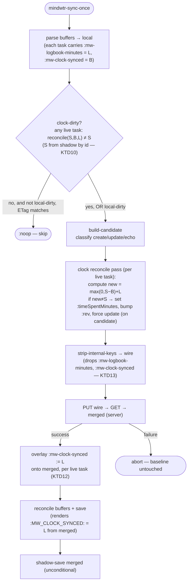
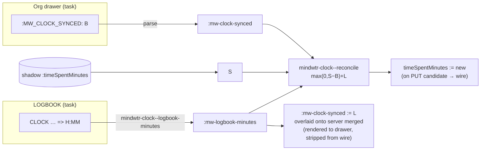

# feat: Roll up org-clock LOGBOOK time into synced `timeSpentMinutes`

Sum each task's closed org-clock LOGBOOK entries and write the total into the
synced `timeSpentMinutes` field — reconciled, not overwriting — so time clocked
in Emacs appears on phone and desktop while time worked outside Emacs is
preserved and kept growing. The device-local baseline that makes the
reconciliation correct lives in the task's own org drawer
(`:MW_CLOCK_SYNCED:`), not a disposable cache file.

**Origin:** `docs/brainstorms/2026-07-19-clock-time-rollup-design.md` (design-approved). This plan enriches that design into implementation units. The reconciliation model and the confirmed behaviors (running-clock exclusion, first-run history dump) are carried forward from the origin; the origin's eleven Key Technical Decisions are extended to thirteen here — KTD12–KTD13 were added during planning, and KTD3/KTD12's persistence mechanism was refined to match the real sync cycle (the baseline is overlaid onto the server `merged` response, not stamped on the PUT candidate).

**Product Contract preservation:** Product scope unchanged from the origin design. No requirement was added, dropped, or re-scoped during planning.

---

## Problem Frame

The client fully supports org clocking — users clock tasks with `org-clock`, CLOCK lines accumulate in LOGBOOK drawers, and `mindwtr-reconcile.el` already preserves LOGBOOK/CLOCK across a buffer rebuild and re-points a running clock. That clocked time is invisible to the rest of Mindwtr because the client has never populated `timeSpentMinutes` (`mindwtr-model.el:229`, `:263-273` — recognized but never written).

The naive fix (write the LOGBOOK sum straight into `timeSpentMinutes`) is wrong two ways the origin called out:

1. The **server also writes** `timeSpentMinutes` (focus/pomodoro sessions on other devices). Overwriting with our sum erases outside time.
2. **LOGBOOK entries can be deleted** in Emacs. An add-only scheme cannot represent our contribution going *down*.

So the write separates the server total into an *outside* portion and an *Emacs* portion, preserves/grows the former, and re-asserts the latter from the current LOGBOOK each cycle.

---

## The Reconciliation Model

Per task, at sync time, three quantities (minutes):

- **L** — current LOGBOOK sum: the total of `=> H:MM` durations on **closed** CLOCK lines under the task heading. A running (open) clock has no `=>` and is excluded by construction.
- **S** — the server's `timeSpentMinutes` as of the shadow (last committed server state this device saw), looked up by task id.
- **B** — the **baseline**: the LOGBOOK sum we last contributed, persisted in the task's own drawer (`:MW_CLOCK_SYNCED:`). Absent ⇒ 0.

```
outside = max(0, S − B)
new     = outside + L
```

On a confirmed-successful cycle, advance `B := L`.

| Case | Effect |
|------|--------|
| Outside work added (phone focus session) | `S` rises above `B`; `outside = S − B` captures it and rides along in every future write. |
| LOGBOOK entry deleted in Emacs | `L` drops below `B`; `new` re-adds the *current* `L`, so the total drops by exactly the removed amount. |
| Nothing changed (`L=B`, `S=outside+B`) | `new = S` — identical value, no push, no `:rev` churn. Stable fixed point. |
| Server below baseline (cleared elsewhere) | `max(0, …)` floors `outside` at 0; we re-assert our own `L`. |
| First activation (`B` absent ⇒ 0) | All LOGBOOK history added once atop the server value. Since Emacs has never written `timeSpentMinutes`, the server value is pure outside time, so this is correct. **(Confirmed desired.)** |

The baseline is the *LOGBOOK sum*, not the last total — that is precisely what lets a deletion propagate.

---

## Requirements

Carried from the origin design; stable IDs for traceability.

- **R1** — Compute `L` per task by summing `=> H:MM` totals of closed CLOCK lines within the task heading's own body (not descendants). A running clock is excluded.
- **R2** — Reconcile with `new = max(0, S − B) + L`, preserving outside time and reflecting LOGBOOK deletions in both directions.
- **R3** — Persist the baseline `B` in a device-local `:MW_CLOCK_SYNCED:` drawer property: never sent on the wire, never part of the content signature, surviving cache/shadow loss because it lives in the org file.
- **R4** — Write the reconciled `new` into the synced `timeSpentMinutes` **only when `new ≠ S`** (no push, no `:rev` bump at the fixed point).
- **R5** — Advance the baseline `B := L` only on a confirmed-successful cycle (alongside the buffer save that persists the drawer).
- **R6** — First activation (baseline absent ⇒ 0) adds the full LOGBOOK history exactly once.
- **R7** — `timeSpentMinutes` stays **out** of `mindwtr-model-content-fields`; it is a sync-computed override, never signed.
- **R8** — A clock-only change (which signs nothing and marks nothing dirty) must force a full sync cycle rather than being skipped by the HEAD-ETag noop gate.
- **R9** — The reconciliation pass touches **only tasks parsed this cycle**; it must never zero `timeSpentMinutes` for a server-live task that was not scanned.

---

## Key Technical Decisions

- **KTD1 — `timeSpentMinutes` stays OUT of `mindwtr-model-content-fields`** (R7). Its written value (`outside + L`) is not reconstructable from the buffer alone, so it cannot join the org content signature without breaking render=parse byte-stability. It is a sync-computed override, reconciled in a dedicated pass, never signed. *No `mindwtr-model.el` change is required — the field is already recognized-only (`mindwtr-model.el:229`).*

- **KTD2 — The reconciliation pass can flip an otherwise-unchanged task into a push.** An unchanged task is echoed verbatim today. The pass must force such a task onto the **update** path (set `timeSpentMinutes`, bump `:rev`) when `new ≠ S`, and only then.

- **KTD3 — Baseline persists in the task's own org drawer, not a sidecar or shadow field** (R3). `:MW_CLOCK_SYNCED:` rides the `MW_ENERGY`-style entity-carried model: parsed into `:mw-clock-synced`, rendered back from the entity value, stripped before the wire, invisible to the signature. Chosen over a `clock-baseline.json` sidecar because the org file is durable and backed up while the shadow/cache dir is disposable — clearing the cache or reinstalling no longer resets the baseline (closes the sidecar-loss double-count). Because it is not a content field, writing it never marks the task dirty (`mindwtr-signature.el` allow-list). Precedent: `docs/solutions/design-patterns/desk-only-vs-synced-property-boundary.md`.

- **KTD4 — Baseline advances only on a confirmed-successful cycle** (R5). The baseline lands in the buffer via the same per-surface save that follows a successful PUT (`mindwtr-sync.el:861-866`). A failed PUT aborts before the buffer save, so `B` is untouched. The one residual: a buffer-*save* failure after a successful PUT leaves `B` un-advanced and re-inflates next cycle — the same rare partial-failure window the sidecar had, now bounded to disk-full/permission errors on the org save. Documented under Risks.

- **KTD5 — Running clock excluded** (R1). Summing only `=> H:MM` closed totals excludes a live clock, so a task being clocked does not recompute `timeSpentMinutes` — or churn `:rev` — on every sync. **(Confirmed.)**

- **KTD6 — Isolated `mindwtr-clock.el` module.** LOGBOOK summing and the pure reconcile function live in one new file; `mindwtr-sync.el` requires it. The `:MW_CLOCK_SYNCED:` parse/render/strip wiring belongs to the existing parse/render layer (it is just another drawer property), not this module.

- **KTD7 — Single Emacs client assumed, drawer baseline degrades gracefully.** Two independent Emacs installs each carry their own `:MW_CLOCK_SYNCED:`, so each treats the other's contribution as *outside* time and preserves it; file-synced org files carry the property along. Tight concurrent multi-Emacs coordination remains out of scope.

- **KTD8 — Per-task only.** `timeSpentMinutes` is a task field; there is no upward roll-up to project/area. "Roll up" means summing a task's several CLOCK entries into one number.

- **KTD9 — The pass runs before the noop gate** (R8). `mindwtr-sync-once` short-circuits to `:noop` at the HEAD-ETag gate (`mindwtr-sync.el:789-804`) when nothing is `local-dirty`. A clock-only change signs nothing, so a clock-dirty predicate (any live task with `new ≠ S`) must be evaluated before that gate and folded into its condition.

- **KTD10 — `S` is read from the shadow, not the post-GET merged value.** The arithmetic needs the server total this device last saw committed — `(gethash id (mindwtr-shadow-index shadow :tasks))`'s `:timeSpentMinutes` — not a value re-merged this cycle, which would double-account.

- **KTD11 — `L` and `B` are read from the parsed local entity by id, never off the wire.** Both are device-local (`:mw-logbook-minutes`, `:mw-clock-synced`) and are stripped before the candidate; the pass looks them up on the parsed `local` entity.

- **KTD12 — The baseline reaches the buffer by overlaying `:mw-clock-synced := L` onto the server `merged` response, per live task, before the reconcile rebuild — not by stamping the PUT candidate.** `mindwtr-sync-once` rebuilds each buffer with `mindwtr-reconcile-buffer merged` (`mindwtr-sync.el:860`), where `merged` is the **server GET** (`:821`); the *candidate* feeds only the PUT wire (`:810`). A baseline stamped on the candidate therefore never renders, and `merged` — a server object — never carries a device-local field on its own. So immediately before the per-surface reconcile loop (`:858`), overlay each live task's `:mw-clock-synced := L` (read from the parsed local `:mw-logbook-minutes`) onto the matching `merged` task entity; the render loop (U2) then writes `:MW_CLOCK_SYNCED:` from that value. Overlaying `L` for **every** live task (not only clock-dirty ones) is the correct invariant: at the fixed point `L = B`, so it preserves unchanged baselines and advances changed ones uniformly, and it sidesteps the echo path building candidates from a `copy-sequence` of the shadow entity (`:354`) that never held the field. This overlay is the **single writer** of the baseline into the buffer, and it lands on the same post-PUT success path as the buffer save (KTD4).

- **KTD13 — Device-local keys are stripped at the sync wire boundary, not the parse boundary.** `:mw-logbook-minutes` and `:mw-clock-synced` must reach the parsed `local` entity (they are reconcile inputs). Because the KTD12 overlay puts `:mw-clock-synced` onto `merged`, which is then persisted by `mindwtr-shadow-save` (`:866`) and copied into next cycle's echo candidate (`copy-sequence` of the shadow entity, `:354`), the field is dropped in `mindwtr-sync--strip-internal-keys` (`mindwtr-sync.el:523`, applied at `:810` just before PUT), **not** in `mindwtr-parse--strip-internal`. It is harmless in the shadow itself — every read path uses `:timeSpentMinutes` or the content signature, never `:mw-clock-synced`.

---

## High-Level Technical Design

Where the reconciliation sits in one sync cycle, and which state each quantity is read from:



Baseline data flow, contrasted with a normal server field:



---

## Components / Implementation Units

### U1. `mindwtr-clock.el` — LOGBOOK sum + reconcile (pure)

**Goal:** A small, dependency-free module holding the two pure computations, independently testable.

**Requirements:** R1, R2.

**Dependencies:** none.

**Files:**
- `mindwtr-clock.el` (new)
- `test/mindwtr-clock-test.el` (new)

**Approach:**
- `mindwtr-clock--logbook-minutes` — at a task heading (point on the heading), scan the heading's own body region `[body-start, (save-excursion (outline-next-heading) (point)))` for closed CLOCK lines matching `CLOCK: [...]--[...] => H:MM` and sum the `=> H:MM` durations into an integer minute count (0 when none). Body-start mirrors `mindwtr-reconcile--body-start` (`mindwtr-reconcile.el:32-43`). Regex-based and independent of live org-clock dynamic state — a running clock line (`CLOCK: [ts]` with no `=>`) is not matched, so it is excluded for free (KTD5). Parse the `H:MM` total (not the per-line start/end timestamps) to avoid DST/timezone arithmetic.
- `mindwtr-clock--reconcile (s b l)` — pure: `(+ (max 0 (- s b)) l)`, coercing nil `s`/`b`/`l` to 0. No I/O.
- Provide the module with `(provide 'mindwtr-clock)` and an autoload cookie per repo convention (`docs/solutions/conventions/autoload-cookies-for-lazy-loadable-emacs-packages.md`).

**Patterns to follow:** heading-body bounding idiom used throughout `mindwtr-reconcile.el` (`:38, :103, :143`); pure-helper + ert style of `mindwtr-signature.el` / its test.

**Test scenarios** (`test/mindwtr-clock-test.el`):
- `mindwtr-clock--reconcile` fixed point: `(reconcile 90 30 30)` → 90 (`outside = max(0, 90−30) = 60`, `L = B = 30`, so `new = 60 + 30 = 90 = S`). Assert the case table: outside-added (`S>B`), logbook-deleted (`L<B` lowers total), unchanged (`L=B, S=outside+B` → `new=S`), underflow (`S<B` → floor at 0, `new=L`), first-run (`B=0` → `new=S+L`).
- `mindwtr-clock--reconcile` nil-coercion: any of `s`/`b`/`l` nil is treated as 0 (`(reconcile nil nil 60)` → 60; `(reconcile 30 nil nil)` → 30).
- `mindwtr-clock--logbook-minutes` over a fixture task with two closed CLOCK lines → their minute sum; with `=> 1:30` → 90; with a running clock line present (open, no `=>`) → excluded from the sum; with no LOGBOOK → 0; with a child heading carrying its own CLOCK → child's clock NOT counted (own-body only).
- `Covers R1.` running-clock exclusion; `Covers R2.` the reconcile case table.

**Verification:** `test/mindwtr-clock-test.el` passes; the reconcile function has no I/O and the logbook summer returns a plain integer for every fixture.

---

### U2. `:MW_CLOCK_SYNCED:` drawer wiring + per-task `L`

**Goal:** Carry `L` and `B` onto every parsed task, persist `B` in the drawer via the `MW_ENERGY`-style rails, and keep both device-local keys off the wire and out of the signature.

**Requirements:** R1 (attach L), R3 (baseline drawer), R7 (signature-safe).

**Dependencies:** U1 (`mindwtr-clock--logbook-minutes`).

**Files:**
- `mindwtr-parse.el`
- `mindwtr-render.el`
- `mindwtr-sync.el` (wire-strip only)
- `test/mindwtr-parse-test.el`
- `test/mindwtr-render-test.el`
- `test/mindwtr-sync-test.el` (home for the R3 wire-strip assertion, which exercises `mindwtr-sync--strip-internal-keys`)

**Approach:**
- **Attach `L` (parse):** in `mindwtr-parse-heading`, for tasks, call `mindwtr-clock--logbook-minutes` at the heading and store the integer under `:mw-logbook-minutes` (always an integer, never nil). This key is a reconcile input only — never rendered, never carried by `merge-content`, never on the wire.
- **Parse `B`:** add `"MW_CLOCK_SYNCED"` to `mindwtr-parse--known-props` (`mindwtr-parse.el:15-31`) so it is consumed, not swept into `:mw-extra-props`; read it kind-agnostically (alongside the `MW_REVIEW_AT`/`MW_REFERENCE_LINK` reads near `:300-308`) into `:mw-clock-synced` as an integer via `string-to-number`; absent ⇒ key absent (treated as 0 downstream).
- **Render `B`:** add `(:mw-clock-synced . "MW_CLOCK_SYNCED")` to `mindwtr-render--prop-names` (`mindwtr-render.el:21-28`) and `:mw-clock-synced` to `mindwtr-render--drawer-order` (`:14-19`) so the generic loop emits it from the entity value. The entity the loop renders is the server `merged` response, which does not carry the baseline on its own — U3 overlays `:mw-clock-synced := L` onto `merged` before the rebuild (KTD12), and the loop writes it from there. **Omit when 0** so that absent ≡ 0 is a single fixed point (0 is non-nil in elisp, so the generic arm would otherwise print `:MW_CLOCK_SYNCED: 0`) — either special-case 0→omit in the render arm or store nil for a 0 baseline. Not a boolean field.
- **Strip from wire:** add `:mw-logbook-minutes` and `:mw-clock-synced` to `mindwtr-sync--strip-internal-keys` (`mindwtr-sync.el:523`, the `memq` at `:532-533`), which runs at `:810` before PUT (KTD13). Do **not** add them to `mindwtr-parse--strip-internal` — the parsed `local` must retain them as reconcile inputs.
- **Signature safety:** neither key is in `mindwtr-model-content-fields`, so `mindwtr-signature--canonical-plist` (`mindwtr-signature.el:56-87`) never visits them and writing them never marks a task dirty (R7). No model change.

**Patterns to follow:** the `MW_ENERGY` known-prop lifecycle end to end — `parse.el` known-props + read loop, `render.el` order + prop-names. Contrast with `:mw-extra-props` (re-read-from-buffer model) which the baseline deliberately does *not* use, because the post-PUT advance must render from the entity value.

**Test scenarios:**
- (`test/mindwtr-parse-test.el`) a task with a LOGBOOK totalling 90 min parses `:mw-logbook-minutes` → 90; a task with `:MW_CLOCK_SYNCED: 60` parses `:mw-clock-synced` → 60 (integer); absent property → `:mw-clock-synced` absent; `MW_CLOCK_SYNCED` does **not** appear in `:mw-extra-props`.
- (`test/mindwtr-render-test.el`) an entity with `:mw-clock-synced 60` renders `:MW_CLOCK_SYNCED: 60` in the drawer; with `:mw-clock-synced 0` (or nil) the property is **omitted**; a parse→render→parse round-trip of a task carrying the property is byte-stable.
- (`test/mindwtr-parse-test.el` or a signature test) a task differing only in `:mw-clock-synced` / `:mw-logbook-minutes` has an unchanged `mindwtr-signature` (not dirty). `Covers R7.`
- Assert `:mw-clock-synced` and `:mw-logbook-minutes` are absent from the output of `mindwtr-sync--strip-internal-keys` on a candidate carrying them. `Covers R3.`

**Verification:** parse and render tests pass; a task's baseline survives a parse→render round-trip; neither device-local key reaches a stripped wire candidate or the signature.

---

### U3. Clock-reconciliation pass in the sync cycle

**Goal:** Wire the reconciliation into `mindwtr-sync-once` — force a cycle on clock-only changes, write `timeSpentMinutes` when it moves, and advance the drawer baseline on success.

**Requirements:** R2, R4, R5, R6, R8, R9.

**Dependencies:** U1, U2.

**Files:**
- `mindwtr-sync.el`
- `test/mindwtr-sync-test.el`

**Approach:**
- **Clock-dirty predicate before the noop gate (R8/KTD9):** before the gate at `mindwtr-sync.el:789`, compute over `(plist-get local :tasks)`: for each task read `L` (`:mw-logbook-minutes`), `B` (`:mw-clock-synced`), `S` (`(plist-get (gethash id (mindwtr-shadow-index shadow :tasks)) :timeSpentMinutes)` — KTD10); `clock-dirty` is true if any `mindwtr-clock--reconcile` result `≠ S`. Fold `(not clock-dirty)` into the gate's `and` so a clock-only change proceeds to a full cycle.
- **`timeSpentMinutes` write in build-candidate (R2, R4, R9, KTD2):** in the task branch of the classification loop (`mindwtr-sync.el:344-368`), after the candidate entity for a live task is formed, compute `new = mindwtr-clock--reconcile(S, B, L)`. When `new ≠ S`: set `:timeSpentMinutes := new` on the candidate, and if it was classified `unchanged` (echo), promote it to update — bump `:rev` from the shadow entity, set `:updatedAt`/`:revBy` (the shadow copy already carries current server content, so an override + rev bump is a valid minimal update). This touches only the PUT candidate. Only tasks present in `(plist-get local :tasks)` are touched (R9) — never iterate shadow/server-live tasks not parsed this cycle.
- **Baseline overlay onto `merged`, then save (R5/KTD4/KTD12):** the PUT candidate does **not** reach the buffer render — `mindwtr-reconcile-buffer` (`:860`) rebuilds from the server `merged` response (`:821`). So immediately before the per-surface reconcile loop (`:858`), overlay `:mw-clock-synced := L` (from parsed `local` `:mw-logbook-minutes`) onto each matching `merged` task entity, for **every** live task. The render loop (U2) then writes `:MW_CLOCK_SYNCED:` from that value, and the buffer save (`:861-864`) is the commit point (`docs/solutions/design-patterns/save-as-sync-commit-point.md`). A failed PUT aborts before this step, leaving `B` untouched; a failed buffer save is the KTD4 residual. Because the overlay lands on `merged`, it flows into `mindwtr-shadow-save` (`:866`) and next cycle's echo — which is exactly why the wire-strip (KTD13) is required.
- **First run (R6):** falls out for free — absent `:mw-clock-synced` ⇒ `B=0` ⇒ `new = S + L`, added once; the overlay then persists `B := L`.

**Execution note:** Start from a failing end-to-end `mindwtr-sync-once` test that asserts a clock-only change bypasses the noop gate and PUTs `timeSpentMinutes` — that contract (R8) is the one most likely to regress and is invisible to unit coverage.

**Test scenarios** (`test/mindwtr-sync-test.el`, mocking `mindwtr-api-http-function` HEAD/PUT/GET and seeding shadow via `mindwtr-shadow-save`):
- **outside-work-preserved:** shadow `S=30`, drawer `B=0`, LOGBOOK `L=60` → PUT body carries `timeSpentMinutes=90`; drawer advances to `:MW_CLOCK_SYNCED: 60`.
- **logbook-deleted-lowers-total:** shadow `S=90`, drawer `B=60`, LOGBOOK now `L=10` → `new = max(0,90−60)+10 = 40` PUT; baseline → 10.
- **unchanged-produces-no-push:** `S=90`, `B=60`, `L=60` → `new=90=S` → no PUT for this task, no `:rev` bump. `Covers R4.`
- **clock-only-change-bypasses-noop-gate:** HEAD ETag matches shadow and nothing else is dirty, but `L` grew → cycle proceeds (not `:noop`) and PUTs the new `timeSpentMinutes`. `Covers R8.`
- **first-run-adds-history:** drawer has no `:MW_CLOCK_SYNCED:`, `S=0`, `L=120` → PUT `120`; baseline → 120. `Covers R6.`
- **baseline-not-advanced-on-failed-buffer-save:** stub `save-buffer` to fail after a successful PUT → assert the (documented) re-inflation exposure is bounded to the save-failure path, i.e. the drawer was not advanced. `Covers R5.` (characterizes KTD4's residual).
- **unscanned-task-untouched:** a task live in shadow but absent from the parsed buffer this cycle keeps its server `timeSpentMinutes` (not zeroed). `Covers R9.`
- **echo-preserves-baseline:** an unchanged task (no content diff, `L=B`) still renders its `:MW_CLOCK_SYNCED:` unchanged after the cycle (guards KTD12 against the echo-copies-shadow trap).
- **two-cycle-persistence (the regression the design hinges on):** run two consecutive `mindwtr-sync-once` cycles over the same file-visiting buffer. Cycle 1: `L=60`, no drawer baseline, shadow `S=0` → PUTs `timeSpentMinutes=60` **and** must leave `:MW_CLOCK_SYNCED: 60` in the buffer *on disk*. Cycle 2: shadow now carries the pushed `timeSpentMinutes=60`, LOGBOOK unchanged → the drawer baseline `B=60` must be **read back from disk** (not injected), yielding `new = max(0,60−60)+60 = 60 = S` → `:noop`, no PUT, no `:rev` bump. This exercises the whole persistence path (overlay → render → save → re-parse) that the direct-injection scenarios above bypass. `Covers R5, KTD12.`

**Verification:** the sync suite passes on Emacs 29.3 / Org 9.6 (Docker) as well as local; a clock-only change round-trips to a PUT and a drawer baseline that survives to the *next* parse (proven by two-cycle-persistence, not just a single-cycle drawer assertion); the fixed point produces no PUT.

---

## Scope Boundaries

**In scope:** per-task reconciliation of LOGBOOK time into `timeSpentMinutes`; the `:MW_CLOCK_SYNCED:` drawer baseline; the clock-dirty gate bypass and the reconcile pass; running-clock exclusion.

**Deferred to Follow-Up Work:** none — the three units are the whole feature.

**Outside this feature's identity:** upward roll-up to project/area totals (a display feature — `timeSpentMinutes` is task-only); tight concurrent multi-Emacs coordination; rendering `timeSpentMinutes` as a hand-editable org property (its truth is LOGBOOK + server); reading the server's internal outside/Emacs split (unavailable). `:MW_CLOCK_SYNCED:` is machine-maintained bookkeeping — a hand-edit is tolerated (it re-bases the next reconcile) but is not a supported interface.

---

## Risks & Dependencies

- **`:rev` churn** — mitigated by KTD5 (closed-clock-only sum) plus the stable fixed point (`new = S` ⇒ no push). The unchanged-no-push test (R4) is required, not optional.
- **Buffer-save failure after a successful PUT (KTD4 residual)** — advances `timeSpentMinutes` on the server but not the drawer baseline, re-inflating by `(L − B_old)` next cycle. Bounded to disk-full/permission errors on the org save; the baseline cannot use the `notes-migrated`-style latch because it lives in the buffer, not the shadow dir. Accepted and characterized by a test.
- **Cold rebuild of org files from the server (accepted residual)** — a full re-fetch discarding local org files loses `:MW_CLOCK_SYNCED:` (the server never stores it), resetting `B` to 0 and re-adding history. Fundamental with a single `timeSpentMinutes` field and no server-side outside/Emacs split; rare and deliberate, unlike a cache clear which the drawer baseline now survives. Documented, not solved.
- **First-run history dump** — a large historical LOGBOOK lands on the server in one sync. Confirmed acceptable (R6).
- **CI is Emacs 29.3 / Org 9.6** — verify LOGBOOK parsing and the sync pass there (Docker), not just local Emacs. Bind `org-element-use-cache nil` in agenda-style cold-scan tests if any are added (`docs/solutions/logic-errors/...`, and the Org 9.6 cold-scan cache caveat).

---

## Verification Contract

- All new and touched suites green: `test/mindwtr-clock-test.el`, `test/mindwtr-parse-test.el`, `test/mindwtr-render-test.el`, `test/mindwtr-sync-test.el`.
- The full smoke suite passes (`test/mindwtr-smoke-test.el`) — no new unknown wire keys leak (both device-local keys are stripped at `:810`).
- Byte-compile clean (no new warnings) for `mindwtr-clock.el` and the three touched files.
- The suite passes under Emacs 29.3 / Org 9.6 via Docker, per project convention.
- Manual smoke: clock a task in Emacs, sync, confirm `timeSpentMinutes` on another surface and `:MW_CLOCK_SYNCED:` in the drawer; delete a CLOCK line, sync, confirm the total drops by exactly that amount.

## Definition of Done

- R1–R9 satisfied, each traced to at least one passing test scenario above.
- `mindwtr-clock.el` exists as an isolated module required by `mindwtr-sync.el`; no LOGBOOK/reconcile logic leaked into parse or render beyond the drawer-property wiring.
- `:MW_CLOCK_SYNCED:` round-trips through parse/render, is stripped from the wire, and is absent from the content signature.
- A clock-only change forces a full cycle and PUTs `timeSpentMinutes`; the fixed point produces no PUT.
- The two accepted residuals (buffer-save-failure, cold-rebuild) are documented in code comments where the baseline is advanced, matching this plan.
- No change to `mindwtr-model-content-fields`; `timeSpentMinutes` remains recognized-only.

---

## Open Questions

- **Property name** — `:MW_CLOCK_SYNCED:` (minutes = the LOGBOOK total last pushed). Alternatives considered: `MW_TIME_SYNCED`. Proceeding with `MW_CLOCK_SYNCED` unless changed before U2; a rename is a trivial sweep.
- **Buffer-save-failure residual (KTD4)** — accepted as-is for this feature. Revisit only if buffer-save failures prove common in practice (they should not).

---

## Sources & Research

- **Origin design:** `docs/brainstorms/2026-07-19-clock-time-rollup-design.md` (reconciliation model, KTD1–11, confirmed behaviors).
- **Signature allow-list:** `mindwtr-signature.el:56-92`; `docs/solutions/design-patterns/content-signature-allow-list-not-deny-list.md`.
- **Device-local drawer precedent:** `docs/solutions/design-patterns/desk-only-vs-synced-property-boundary.md`.
- **Save as commit point:** `docs/solutions/design-patterns/save-as-sync-commit-point.md`.
- **Sync seams:** noop gate `mindwtr-sync.el:789-804`; classify `:171-177`; build-candidate `:306, :344-368`; merge-content `:120-144`; strip-internal-keys `:523`; PUT/save/shadow-save `:814, :861-866`.
- **Parse/render seams:** known-props `mindwtr-parse.el:15-31`; kind-agnostic reads `:300-308`; strip-internal `:323-330`; render order/names `mindwtr-render.el:14-28`; generic emit arm `:167-181`.
- **LOGBOOK bounding:** `mindwtr-reconcile.el:32-43` (body-start), heading-own-body idiom `:38,:103,:143`.
- **Field status:** `timeSpentMinutes` in `mindwtr-model-known-fields` (`mindwtr-model.el:229`), absent from `mindwtr-model-content-fields` (`:156-162`), documented recognized-only (`:263-273`).
- **Upstream contract:** `Task.timeSpentMinutes?: number` (core `types.ts`), a server content-signature participant (`sync-signatures.ts`).
